# TESQIVO — Refined Product Requirements Specification

**Version:** 3.0  
**Status:** Baseline for diagrams and architecture  
**Date:** 26 August 2026  

## 1. Purpose

This specification defines what TESQIVO must deliver before detailed diagrams and development begin. It separates mandatory MVP scope from later capabilities and establishes the domain rules that architecture, APIs, database design, GUI design, and testing must follow.

## 2. Product Vision

TESQIVO is an API-first Test Management and Quality Engineering platform that acts as the **system of record for software quality**.

It must connect the lifecycle:

> Requirement → Test Case → Test Plan → Test Cycle → Test Execution → Defect → Release Readiness

TESQIVO will first support in-house, self-hosted installation through Docker Compose and later evolve into a cloud-hosted product.

### 2.1 Primary Product Differentiators

1. **End-to-end test traceability** with an interactive traceability matrix
2. **Rich, drill-down reporting** with consistent metric definitions
3. **User-friendly, responsive, and interactive GUI**
4. Strong single-item and bulk operations
5. Immutable execution history and complete auditability
6. API-first automation integration
7. Simple self-hosted deployment
8. Later-stage, human-governed AI test-case generation

### 2.2 Target Users

- System and project administrators
- QA leads and test managers
- Manual testers
- Automation engineers
- Developers
- Release managers
- Auditors and read-only stakeholders

## 3. Product Principles

### P-01 — API First

Every major GUI action must use a documented backend API. Authorization, validation, workflow, audit, and transaction rules must be enforced on the server.

### P-02 — Shared Single and Bulk Logic

Single and bulk actions must use the same domain services. Bulk processing must not bypass rules that apply to an individual record.

### P-03 — Historical Integrity

Editing a test case must never alter completed execution evidence. Executions must retain the exact test-case version and step content that were executed.

### P-04 — Traceability by Design

Traceability links must be structured domain relationships, not text conventions or report-only calculations.

### P-05 — Safe Data Lifecycle

Archive and soft delete are the normal removal mechanisms. Permanent deletion must be restricted, explicit, and audited.

### P-06 — Human-Governed AI

AI-generated content must enter TESQIVO as a suggestion or draft. It cannot silently overwrite approved test assets, create misleading coverage, or bypass review, authorization, versioning, and audit rules.

### P-07 — Self-Hosting as a Product Feature

Docker deployment must include initialization, migrations, persistence, health checks, restart recovery, backup guidance, and secure first-admin creation.

## 4. Scope and Roadmap

### 4.1 Phase 1 — Self-Hosted TCMS MVP

- Local authentication and user management
- Projects, membership, and default RBAC roles
- Hierarchical test repository
- Test-case CRUD, steps, workflow, cloning, versioning, archive, and restore
- Strong single and bulk test-case actions
- Test plans and test cycles
- Manual execution and step-level evidence
- Immutable execution snapshots and execution history
- Project, plan, cycle, and execution dashboards
- Structured filters and interactive drill-down
- Lightweight Requirement, Release, and Defect records
- Structured traceability links and basic interactive traceability matrix
- Design, plan, execution, and pass-coverage metrics
- Traceability filtering, drill-down, and CSV export
- CSV import and export
- Audit trail
- Background jobs for large operations
- Local file attachments
- REST API for every major MVP operation
- PostgreSQL persistence
- Docker Compose installation

### 4.2 Phase 2 — Advanced Traceability and Quality Engineering

- Rich requirement and defect workflows plus external synchronization
- Advanced end-to-end traceability graph and matrix customization
- Advanced reports, saved views, and global search
- Automation result API and JUnit XML ingestion
- CI/CD integration guidance and API tokens
- Webhooks and delivery history
- Jira, GitLab, and Azure DevOps integrations
- S3-compatible attachment storage
- In-app and email notifications

**Boundary decision:** Phase 1 includes the Traceability Foundation defined in Section 25. Advanced workflows, external synchronization, saved matrix views, graph analytics, and release-readiness scoring remain later-phase features.

### 4.3 Phase 3 — AI and Advanced Intelligence

- AI test-case generation from requirements, user stories, API specifications, and selected documents
- AI suggestions for missing scenarios, negative cases, boundaries, and coverage gaps
- Duplicate and near-duplicate test detection
- AI-assisted test maintenance and impact analysis
- Failure summaries and probable failure grouping
- Automation candidate recommendations
- Flaky-test and test-effectiveness analytics
- Configurable release-readiness scoring
- Risk-based regression recommendations

### 4.4 Phase 4 — Cloud / SaaS

- Organizations and workspaces
- Multi-tenancy and tenant isolation
- SSO providers
- Subscription and usage management
- Cloud storage
- Kubernetes deployment and horizontal scaling
- Tenant-level security and configuration
- Cloud observability, rate limiting, backup, and disaster recovery

### 4.5 Explicit MVP Exclusions

- Multi-tenancy and subscriptions
- Enterprise SSO
- AI generation and predictive scoring
- External ALM integrations
- Fully configurable roles, workflows, and dashboard layouts
- Kubernetes deployment
- Native mobile applications

## 5. Core Domain Model

| Entity | Purpose |
|---|---|
| Project | Security and configuration boundary for quality data. |
| Test Folder | Hierarchical organization inside a project. |
| Test Case | Reusable test definition and metadata. |
| Test Case Version | Immutable test content at a point in time. |
| Requirement | Business or technical need requiring coverage. |
| Test Plan | Testing objective, release, milestone, or regression scope. |
| Test Cycle | Executable portion of a plan for a build and environment. |
| Cycle Test | Selected test-case version, assignment, and current state. |
| Execution | One attempt to run a cycle test. |
| Execution Step | Result and evidence for a snapshotted test step. |
| Defect | Failure record linked to evidence and affected scope. |
| Release | Project delivery target. |
| Audit Event | Immutable record of a significant action. |
| Background Job | Asynchronous bulk, import, export, or report operation. |

### 5.1 Identifier Rules

- Internal IDs must be globally unique.
- Project keys are unique and immutable.
- Test cases use readable IDs such as `PAY-TC-101`.
- Plans, cycles, executions, requirements, and defects should use typed readable IDs.
- Deleted identifiers must never be reused.
- Display-name changes must not change identifiers.

### 5.2 Relationship Rules

- Project-owned entities cannot be linked across projects unless a later feature explicitly supports it.
- A test case has one current version and immutable historical versions.
- A plan contains one or more cycles.
- A cycle stores the selected test-case version.
- A cycle test may have multiple execution attempts.
- Completed attempts remain immutable except for an audited manager correction.
- Requirements and defects must connect through structured links that retain source and history.

## 6. Authentication and Authorization

### 6.1 MVP Authentication

- Username or email plus password
- Secure password hashing
- Login, logout, and password change
- Administrator-initiated password reset
- Configurable session expiry
- Failed-login protection
- Disabled accounts
- Secure, documented first-System-Admin creation

### 6.2 Default Roles

| Role | Scope | Capability |
|---|---|---|
| System Admin | Instance | Users, configuration, and all projects |
| Project Admin | Project | Project settings and membership |
| Test Manager | Project | Repository, cases, plans, cycles, and reports |
| Tester | Project | Assigned and permitted executions |
| Viewer | Project | Read-only project access |

Authorization must be enforced on every protected API. A non-member must not access project data by manipulating a URL or request. Archived users remain visible in historical records.

## 7. Project and Repository Requirements

### FR-PRJ-01 — Projects

Authorized users can create, update, archive, and restore projects. Required fields are name, immutable key, description, owner, status, and audit metadata.

### FR-PRJ-02 — Membership

Project Admins can add active users, assign/change roles, and remove membership. Removal revokes future access without deleting historical assignments or authorship.

### FR-PRJ-03 — Reference Data

Projects configure components, releases, environments, tags, test types, and permitted attachment policies. Values already in use must be archived rather than hard-deleted.

### FR-REP-01 — Folder Hierarchy

Authorized users can create, rename, move, archive, and restore folders. TESQIVO must prevent circular hierarchies, cross-project movement, and moves into a descendant.

## 8. Test-Case Management

### 8.1 Core Fields

- Readable ID and title
- Description and preconditions
- Ordered steps with action and expected result
- Priority: Critical, High, Medium, Low
- Test type
- Automation status: Manual, Candidate, Automated, Not Applicable
- Workflow status
- Owner and reviewer
- Folder, component, and tags
- Requirement links when Phase 2 is enabled
- Attachments
- Version and created/updated metadata

Severity belongs primarily to defects and execution failures. It may be optional test-case metadata but must not be mandatory in the MVP.

### FR-TC-01 — Lifecycle

Authorized users can create, edit, clone, move, review, approve, activate, deprecate, archive, restore, and inspect history.

Recommended workflow:

> Draft → In Review → Approved → Active → Deprecated → Archived

Editing an Approved or Active test case creates a new Draft version. The previously approved version remains available for existing cycles and execution history.

### FR-TC-02 — Versioning

A version is created when execution meaning changes, including title, description, preconditions, step action/order/expected result, or other controlled content. Assignment, folder, and tag changes may remain audit-only. The trigger policy must be centralized.

Each version stores content, version number, author, timestamp, status, and change summary. Historical versions are read-only.

### FR-TC-03 — Cycle Selection

When a cycle is activated, it stores the selected approved/current test-case versions. A manager may refresh a not-started cycle test to a newer version. Started or completed attempts cannot be silently refreshed.

## 9. Single and Bulk Operations

### 9.1 MVP Bulk Actions

- Change priority, owner, component, or automation status
- Add or remove tags
- Move folder
- Clone
- Archive or restore
- Add to or remove from a plan
- Export

### 9.2 Required Behavior

- Users can select explicit rows or all results matching a filter.
- A confirmation view displays action, filters, resolved count, and impact.
- Every target receives the same authorization and validation as a single action.
- Large operations run asynchronously above a configurable threshold.
- Results show total, succeeded, failed, and skipped counts with item-level reasons.
- Retrying failures must not repeat successful mutations.
- Requests must be protected against accidental duplicate processing.
- Every job and item change is auditable.
- Independent records default to partial success; import also offers strict all-or-nothing mode.

Bulk permanent deletion is excluded from ordinary user workflows.

## 10. Plans, Cycles, and Executions

### FR-PLAN-01 — Test Plans

A plan represents a release, feature, milestone, or regression objective. Users can create, edit, clone, archive, associate a release, add test cases manually or through filters, assign an owner, and view progress.

Statuses: Draft, Active, Completed, Archived.

### FR-CYCLE-01 — Test Cycles

A cycle includes name, description, environment, release, build, optional browser/device/platform, dates, assigned testers, selected test versions, and status.

Statuses: Draft, Active, Completed, Reopened, Archived.

Only Draft cycles freely change scope. Scope changes after activation are audited. Completed cycles are read-only unless reopened by a permitted user with a reason.

### FR-EXEC-01 — Execution Attempts

Every attempt captures project, plan, cycle, release, environment, build, tester, immutable test-case snapshot, start/end time, duration, overall result, step results, notes, evidence, and linked defects where enabled.

Attempt statuses:

- IN_PROGRESS
- PASSED
- FAILED
- BLOCKED
- SKIPPED
- ABORTED

`NOT_RUN` describes a cycle test before an attempt exists.

### FR-EXEC-02 — Step-Level Result

Each step supports NOT_RUN, PASSED, FAILED, BLOCKED, or SKIPPED, plus actual result, comments, evidence, and completion time.

Default overall result:

1. Any failed step → FAILED
2. Otherwise any blocked step → BLOCKED
3. Otherwise all required steps passed or skipped → PASSED
4. Otherwise → IN_PROGRESS

Overrides require permission and an audited reason. Retesting creates a new attempt. Completed attempts are locked; manager correction preserves the old value and reason.

### FR-EXEC-03 — Concurrent Editing

TESQIVO must prevent silent overwrites through optimistic concurrency or equivalent checks. Stale updates receive a conflict response.

## 11. Traceability — Flagship Capability

Traceability must answer:

- Which test cases cover a requirement?
- Which requirements have no, incomplete, or outdated coverage?
- Which test version was planned and executed?
- Which tests have not run for a selected release, cycle, or environment?
- Which failures and defects affect a requirement or release?
- What evidence supports a release-readiness conclusion?

### FR-TRC-01 — Link Types

The model must support:

- Requirement ↔ Test Case
- Requirement ↔ Release
- Test Case Version ↔ Plan/Cycle
- Cycle Test ↔ Execution Attempt
- Execution ↔ Defect
- Defect ↔ Requirement/Release

Each link stores its creator/source, creation time, status, and external reference where applicable.

### FR-TRC-02 — Interactive Traceability Matrix

The matrix must provide:

- Rows by requirement with expandable test cases and executions
- Configurable columns for plan, cycle, release, environment, latest result, defects, owner, priority, and coverage
- Filters for project, release, component, requirement status/type, test status/type, environment, build, and date
- Frozen headers/identifier columns, sorting, resizing, pagination or virtualization
- Expand/collapse, hover details, and direct navigation to source records
- Color plus text/icons so status is not color-dependent
- Drill-down from every count to the contributing records
- Saved views in Phase 2
- CSV/Excel export of the filtered matrix
- Clear handling of missing, stale, unmapped, and conflicting data

### FR-TRC-03 — Coverage Definitions

Central definitions must distinguish:

- **Design coverage:** requirement has at least one active linked test case
- **Plan coverage:** requirement has at least one linked test in selected plan/cycle scope
- **Execution coverage:** requirement has at least one completed execution in selected scope
- **Pass coverage:** required in-scope tests satisfy the configured passing rule

Coverage must not count an AI-generated Draft as valid design coverage until a user reviews and activates it.

### FR-TRC-04 — Freshness

Traceability views display calculation time and selected scope. Links to deprecated tests, obsolete requirement versions, stale executions, or archived records must be visibly distinguished rather than silently ignored.

## 12. Dashboards and Rich Reporting

### FR-RPT-01 — MVP Dashboards

Provide project, plan, and cycle dashboards with:

- Total scoped tests
- Not run, in progress, passed, failed, blocked, and skipped
- Execution completion and pass rate
- Results by cycle, tester, component, environment, and build
- Recent activity
- Top failures and blocked areas
- Direct drill-down to filtered records

### FR-RPT-02 — Phase 2 Reports

- Traceability matrix and requirement coverage
- Release execution summary
- Failure analysis
- Defect summary and leakage
- Automation coverage
- Execution and pass-rate trends
- Tester workload
- Test inventory, aging, and reusability
- Audit report

Phase 3 adds flaky-test, effectiveness, risk, and release-readiness reports.

### 12.1 Central Metric Definitions

| Metric | Default definition |
|---|---|
| Execution completion | `(Passed + Failed + Blocked + Skipped) / Total scoped cycle tests × 100` |
| Pass rate | `Passed / (Passed + Failed + Blocked) × 100` |
| Not run | Scoped cycle tests without a completed or current in-progress attempt |
| Automation coverage | `Automated active tests / Active automation-eligible tests × 100` |

Metrics must define scope, zero-denominator behavior, archive handling, authoritative attempt, date/time zone, and refresh timestamp. GUI, API, and exports must use the same definitions.

### FR-RPT-03 — Interactive Reporting

- Global filters apply consistently to compatible widgets.
- Clicking any metric or chart segment opens its contributing records.
- Users can switch table/chart views where meaningful.
- Tables support sorting, column selection, resizing, pagination/virtualization, and export.
- Long calculations run as background jobs with visible progress.
- Empty, loading, stale, error, and partial-data states are explicit.

## 13. GUI and User Experience

### UX-01 — Navigation

The GUI must provide consistent navigation for Dashboard, Repository, Plans, Cycles, Executions, Traceability, Reports, Jobs, and Project Settings. Breadcrumbs and stable URLs must make deep pages understandable and shareable.

### UX-02 — Efficient Workflows

- Common actions are available without excessive page changes.
- List views preserve filters and position after record updates where practical.
- Inline editing may be used only when validation and audit behavior remain clear.
- Bulk selection clearly differentiates selected page rows from all filtered results.
- Destructive or high-impact actions show scope, consequence, and confirmation.
- Forms preserve unsaved work or warn before navigation.
- Success and error messages state what happened and what the user can do next.

### UX-03 — Interactive Execution

Execution screens should provide step navigation, keyboard-friendly status updates, evidence upload, clear remaining-step progress, autosave or explicit saved state, and conflict handling.

### UX-04 — Accessibility and Responsiveness

- Target WCAG 2.1 AA for core workflows.
- Keyboard-accessible navigation and controls
- Visible focus indicators and semantic labels
- Status not communicated by color alone
- Desktop-first responsive layout with practical tablet support
- Latest two stable Chrome, Edge, and Firefox versions supported

### UX-05 — Performance Perception

Use skeleton/loading states, progressive rendering, pagination or virtualization, optimistic feedback only when safe, and non-blocking background progress. The GUI must never appear frozen during bulk or reporting work.

### UX-06 — Design System

A reusable design system must define colors, typography, spacing, buttons, forms, tables, badges, status icons, dialogs, notifications, charts, accessibility behavior, and responsive rules. The same status must use consistent labels and visual treatment across the application.

## 14. Import, Export, and Attachments

### FR-IMP-01 — CSV Import

Flow: Upload → Map columns → Preview → Validate → Choose strict/partial mode → Confirm → Review results.

- Strict mode commits only if all rows are valid.
- Partial mode commits valid rows and reports invalid rows.
- Duplicate behavior is explicit: skip, update by stable ID, or create.
- The result provides success/warning/error counts and a downloadable error file.
- Import uses normal authorization, validation, versioning, and audit services.

Excel may follow CSV once the behavior is stable.

### FR-EXP-01 — Export

Selected or filtered authorized data can be exported to CSV; Phase 2 adds Excel where valuable. Large exports are background jobs with time-limited authorized downloads.

### FR-ATT-01 — Attachments

Files may belong to test-case versions, executions, and execution steps. TESQIVO must enforce configurable size/type limits, safe names, path protection, parent authorization, upload/deletion audit, and orphan cleanup. Phase 1 uses persistent local storage; Phase 2 adds S3-compatible storage.

## 15. Audit Trail and Background Jobs

### FR-AUD-01 — Audit Events

Capture event ID, UTC time, actor/system identity, project, entity, action, relevant before/after values, source, correlation ID, and parent bulk-job ID. Passwords, tokens, secrets, and file contents must never be logged.

Audit user/security, project/member, case/version/workflow, plan/cycle, execution/correction, import/export/bulk, attachment, permission, and configuration changes. Audit records are append-only through normal APIs.

### FR-JOB-01 — Background Processing

Jobs expose type, creator, scope, creation time, status, progress, success/failure/skipped counts, item-level errors, outputs, and retries.

Statuses: Queued, Running, Completed, Partially Completed, Failed, Cancelled.

Jobs must survive worker restart, be safe against duplicate delivery, and avoid duplicating successful changes during retry.

## 16. REST API

- Versioned path, initially `/api/v1`
- JSON except file transfers
- Consistent resources and error schema
- Pagination, filtering, sorting, and structured search parameters
- Authentication and project authorization
- UTC ISO 8601 timestamps
- Correlation/request IDs
- Optimistic concurrency on critical updates
- Idempotency for harmful duplicate creates and ingestion retries
- Generated OpenAPI documentation

Errors include a stable code, readable message, field errors, and correlation ID without stack traces or secrets.

## 17. AI Test-Case Generation — Phase 3

### AI-01 — Supported Inputs

AI generation may accept:

- Internal or synchronized requirements and user stories
- Acceptance criteria
- OpenAPI/Swagger specifications
- Selected text documents
- Existing related test cases and project testing standards

### AI-02 — Generated Output

AI may propose:

- Test-case title, description, and preconditions
- Positive, negative, boundary, validation, security, API, UI, and data scenarios as relevant
- Ordered steps and expected results
- Suggested priority, type, component, tags, and automation candidacy
- Source requirement links and generation rationale
- Assumptions, ambiguities, and missing-information warnings

### AI-03 — Review Workflow

1. User selects source and generation preferences.
2. TESQIVO creates a generation job.
3. AI output appears in a review workspace, not the active repository.
4. User compares suggestions, edits fields, rejects duplicates, and selects items.
5. Accepted items are created as Draft test cases.
6. Normal review/approval activates coverage.

### AI-04 — Governance and Safety

- AI output is visibly labeled as generated or assisted.
- Model/provider, generation time, source references, prompt/template version, and accepting user are audited.
- Source access uses the requesting user’s permissions.
- Sensitive project content is not sent to a provider unless that provider/configuration is authorized.
- Users can reject, edit, regenerate, or accept individual suggestions.
- AI cannot delete or overwrite approved test cases automatically.
- AI drafts do not count toward valid coverage until reviewed and activated.
- Duplicate detection runs before acceptance.
- Provider integration uses an abstraction so the core domain is not tied to one AI service.

### AI-05 — Quality Measurement

Track acceptance rate, edit distance, duplicate rate, reviewer feedback, requirement coverage contribution after approval, and defects later associated with accepted AI-created tests. These metrics evaluate usefulness; they must not be presented as proof that AI output is correct.

## 18. Self-Hosted Deployment

The supported Docker Compose package initially includes web UI, backend API, background worker, PostgreSQL, Redis or equivalent broker, and reverse proxy where required.

A documented clean installation must support:

```bash
docker compose up -d
```

and provide:

- Database readiness and automated migrations
- Persistent volumes
- Health checks and restart behavior
- Secure initial administrator setup
- Clear failure for missing mandatory configuration
- Installation, upgrade, logs, backup, restore, and recovery guidance

Configuration and secrets are externalized. Secrets must not be committed, logged, or exposed to the frontend.

## 19. Non-Functional Requirements

### Performance

- 95% of ordinary API reads complete within 500 ms server time in the reference environment.
- 95% of ordinary creates/updates complete within 1 second, excluding file transfer/background work.
- Lists use server-side pagination and support at least 100,000 test cases in a large project.
- Background bulk requests are accepted within 2 seconds.
- Dashboard summaries complete within 3 seconds or show cached freshness.
- Large traceability tables use server-side querying plus pagination or virtualization.

### Reliability and Integrity

- Committed data survives service/container restart.
- Database constraints enforce relationships and project boundaries.
- Accepted jobs recover after worker restart.
- Migrations are versioned, repeatable, and upgrade-tested.
- Timestamps are stored in UTC and displayed in the selected/browser time zone.

### Security

- Current adaptive password hashing
- Server-side authorization with negative tests
- Protection against common injection, scripting, request-forgery, access-control, and unsafe-upload risks
- Secure cookie settings when cookies are used
- Rate limiting of login and sensitive endpoints
- Dependency and image scanning in CI
- No secrets or stack traces in production output

### Maintainability and Observability

- Modular boundaries and database migrations
- Unit, integration, API, authorization, migration, and end-to-end tests
- CI formatting, linting, tests, vulnerability checks, and image build
- Structured logs and correlation IDs
- API, worker, database-dependency, and readiness health endpoints

### Backup and Recovery

Backup covers PostgreSQL and attachments. Restore must be tested before production readiness. Initial proposed internal targets are RPO 24 hours and RTO 4 hours.

## 20. MVP Acceptance Criteria

1. **Installation:** A clean host starts TESQIVO through documented Docker Compose configuration; migrations finish, services become healthy, admin setup is secure, and data persists after recreation.
2. **Authorization:** Every default role passes permitted checks and fails forbidden checks; non-members cannot access project data via GUI or API.
3. **Vertical slice:** A user completes Project → Repository → Versioned Test Case → Plan → Cycle → Step Execution → Dashboard.
4. **History:** Editing an executed test creates a new version while the execution shows the exact older snapshot.
5. **Bulk actions:** Explicit and filtered selections provide preview, progress, partial results, errors, safe retry, and audit evidence.
6. **Reporting:** Dashboard numbers match centralized formulas and every count drills into the same contributing records.
7. **GUI:** Core workflows pass keyboard, responsive-layout, validation, loading/error-state, and usability acceptance checks.
8. **Import/export:** CSV strict and partial modes behave as documented; exported scope matches authorized source data.
9. **Audit:** Critical UI, API, import, and bulk changes record complete audit events without secrets.
10. **API parity:** Every major MVP GUI action uses a documented application API.
11. **Recovery:** A backup restores project data, versions, executions, audit events, and attachments into a clean supported environment.
12. **Quality gate:** Critical automated tests pass and no unresolved Critical/High security issue lacks documented approval.

## 21. Decisions Required Before Architecture Freeze

| ID | Decision | Recommended starting point |
|---|---|---|
| D-01 | Frontend/backend technologies | Choose for team capability; preserve API boundary. |
| D-02 | Web authentication transport | Secure server-side session with HttpOnly cookie. |
| D-03 | Excel import in MVP | CSV first; `.xlsx` only for an initial-adopter need. |
| D-04 | Approval workflow in MVP | Include basic workflow if review/approval is required internally. |
| D-05 | Version selection | Snapshot current approved version at cycle activation. |
| D-06 | Authoritative execution | Latest completed attempt; manager can select another with reason. |
| D-07 | Background-job threshold | Configurable; initial proposal 500 records. |
| D-08 | Attachment limit | Configurable; initial proposal 25 MB/file plus allowlist. |
| D-09 | Reference scale | 100 projects, 100,000 cases/large project, 1,000,000 executions/instance. |
| D-10 | Requirement strategy | Internal records plus external references, then provider synchronization. |
| D-11 | Defect strategy | Lightweight internal defect plus external-provider links. |
| D-12 | AI provider policy | Provider abstraction with instance-level data/privacy configuration. |

## 22. Required Diagram Set

Create diagrams in this order:

1. Product context and actor diagram
2. Core navigation and user-flow map
3. Test-case lifecycle/versioning state diagram
4. Plan, cycle, and execution state diagrams
5. Traceability relationship model and matrix interaction flow
6. Core entity-relationship diagram
7. Logical component architecture
8. Docker deployment diagram
9. Authentication/authorization sequence
10. Manual execution sequence
11. Bulk-job and import sequences
12. Reporting and traceability query flow
13. Phase 2 automation-ingestion flow
14. Phase 3 AI generation, review, and approval flow

Domain, state, and traceability diagrams must be reviewed before database tables or implementation code are finalized.

## 23. AI-Assisted Development Rules

Before generating code, an AI development model must:

1. Treat this specification and confirmed decisions as scope authority.
2. Separate MVP requirements from later phases.
3. Resolve domain invariants and states before database models.
4. Preserve immutable versions, execution snapshots, and audit records.
5. Enforce authorization, validation, workflow, and audit in backend services.
6. Reuse domain services for UI, API, import, automation, and bulk actions.
7. Centralize traceability and reporting definitions.
8. Use database constraints, transactions, and migrations.
9. Keep storage, authentication, integrations, and AI providers behind stable boundaries.
10. Avoid implementing SaaS, AI, or advanced analytics in the MVP.
11. Include automated tests with each feature.
12. Treat Docker install, upgrade, persistence, backup, and restore as product features.

## 24. Immediate Development Goal

The first goal is a reliable self-hosted vertical slice:

> Login → Project → Repository → Versioned Test Case → Test Plan → Test Cycle → Step-Level Execution → Interactive Dashboard

The slice includes REST APIs, RBAC, audit events, persistence, Docker deployment, and GUI quality foundations. Bulk operations, import/export, background jobs, and production hardening then complete Phase 1.

The Phase 1 Traceability Foundation must be delivered with the core vertical slice; Phase 2 expands it with advanced workflows, synchronization, saved views, and analytics. AI generation must be architecturally anticipated but implemented only after the core lifecycle, traceability, reporting, and GUI are stable.

## 25. Traceability Foundation MVP Boundary

### 25.1 Decision

Traceability is a differentiator and therefore cannot be postponed completely. The MVP will deliver a **Traceability Foundation** that proves the full data path without implementing enterprise ALM synchronization or advanced analytics.

### 25.2 Included in Phase 1

- Lightweight Requirement, Release, and Defect records using the minimum schemas in Section 27
- Requirement ↔ Test Case links
- Requirement ↔ Release links
- Release ↔ Test Plan/Test Cycle links
- Test Case Version ↔ Cycle Test links
- Execution ↔ Defect links
- Defect ↔ Requirement/Release links
- Link creation, removal, source, timestamps, actor, and audit history
- Basic interactive matrix with Requirement rows and expandable Test Case/Execution detail
- Filters for release, component, requirement status, test status, cycle, environment, and result
- Central design, plan, execution, pass, and defect-impact coverage metrics
- Drill-down from matrix counts and metrics to contributing records
- CSV export of the filtered matrix
- Missing-coverage, not-run, failed, blocked, stale, and archived indicators
- Permission enforcement and API support for every included operation

### 25.3 Deferred Beyond Phase 1

- Jira, Azure DevOps, GitLab, GitHub, or other provider synchronization
- Configurable requirement and defect workflows
- Relationship graph visualization and path analysis
- Saved/shared matrix views and configurable matrix layouts
- Cross-project traceability
- Excel/PDF formatted matrix exports
- Configurable readiness scoring and predictive risk
- Baseline comparison and release-over-release impact analytics
- AI-generated coverage recommendations

### 25.4 MVP Exit Test

For one release, a user must be able to create a requirement, link an approved test case, include its version in a cycle, execute it, link a failed execution to a defect, and see the complete chain and correct coverage values in the matrix and CSV export.

## 26. Domain State-Transition Catalog

All transitions require an authenticated actor, entity permission, valid current state, optimistic-concurrency check, and audit event. “System” transitions are still audited with a system actor.

| Domain | From | Event | To | Allowed actor | Guard / rule |
|---|---|---|---|---|---|
| Project | Active | Archive | Archived | System Admin, Project Admin | No in-progress destructive job; access becomes read-only except restore. |
| Project | Archived | Restore | Active | System Admin, Project Admin | Project key remains unchanged. |
| Test Case | Draft | Submit review | In Review | Author, Test Manager | Required fields and at least one valid step. |
| Test Case | In Review | Request changes | Draft | Reviewer, Test Manager | Review comment required. |
| Test Case | In Review | Approve | Approved | Reviewer, Test Manager | Reviewer cannot be author if separation-of-duty policy is enabled. |
| Test Case | Approved | Activate | Active | Test Manager | Approval applies to current version. |
| Test Case | Active | Edit controlled content | Draft (new version) | Author, Test Manager | Old active version remains immutable and usable by existing cycles. |
| Test Case | Active | Deprecate | Deprecated | Test Manager | Reason required; excluded from new selection by default. |
| Test Case | Draft/In Review/Approved/Active/Deprecated | Archive | Archived | Test Manager, Project Admin | Existing execution history remains visible. |
| Test Case | Archived | Restore | Previous non-archived state | Test Manager, Project Admin | Restore records prior state; policy may restore as Draft. |
| Requirement | Draft | Activate | Active | Test Manager, Project Admin | ID and title required. |
| Requirement | Active | Mark fulfilled | Fulfilled | Test Manager, Project Admin | Release link recommended; coverage status does not auto-change lifecycle. |
| Requirement | Draft/Active/Fulfilled | Archive | Archived | Test Manager, Project Admin | Links remain historical and are excluded by default. |
| Release | Planned | Start | Active | Project Admin, Test Manager | Start date reached or explicit override reason. |
| Release | Active | Complete | Released | Project Admin, Test Manager | No mandatory blocking gate fails, or override reason and permission supplied. |
| Release | Planned/Active | Cancel | Cancelled | Project Admin | Reason required. |
| Release | Released/Cancelled | Archive | Archived | Project Admin | Historical plans, cycles, executions, and defects remain accessible. |
| Test Plan | Draft | Activate | Active | Test Manager | At least one cycle or scoped test. |
| Test Plan | Active | Complete | Completed | Test Manager | No cycle remains Active unless override policy permits. |
| Test Plan | Completed | Reopen | Active | Test Manager | Reason required. |
| Test Plan | Draft/Active/Completed | Archive | Archived | Test Manager, Project Admin | History preserved. |
| Test Cycle | Draft | Activate | Active | Test Manager | At least one cycle test; selected versions are snapshotted. |
| Test Cycle | Active | Complete | Completed | Test Manager | No attempt In Progress. |
| Test Cycle | Completed | Reopen | Reopened | Test Manager | Reason required. |
| Test Cycle | Reopened | Complete | Completed | Test Manager | No attempt In Progress. |
| Test Cycle | Draft/Active/Completed/Reopened | Archive | Archived | Test Manager, Project Admin | History preserved. |
| Cycle Test | Not Run | Start attempt | In Progress | Assigned/permitted Tester | Cycle is Active or Reopened. |
| Cycle Test | In Progress | Complete attempt | Passed/Failed/Blocked/Skipped/Aborted | Executing Tester, Test Manager | Overall result conforms to step rules or override reason exists. |
| Cycle Test | Terminal result | Retest | In Progress | Assigned/permitted Tester | Creates a new attempt; previous attempts unchanged. |
| Defect | New | Triage | Open | Test Manager, Project Admin | Priority, severity, and owner set. |
| Defect | Open | Start work | In Progress | Owner, Test Manager | Active owner required. |
| Defect | In Progress | Resolve | Resolved | Owner, Test Manager | Resolution and affected build/version required. |
| Defect | Resolved | Verify | Closed | Tester, Test Manager | Verification evidence or comment required. |
| Defect | Resolved/Closed | Reopen | Open | Tester, Test Manager | Reason required. |
| Defect | New/Open/In Progress/Resolved/Closed | Reject | Rejected | Test Manager | Rejection reason required. |
| Background Job | Queued | Worker claims | Running | System | Lease/claim recorded. |
| Background Job | Running | Finish all | Completed | System | No failed item. |
| Background Job | Running | Finish mixed | Partially Completed | System | At least one success and one failure/skip. |
| Background Job | Queued/Running | Cancel | Cancelled | Creator or authorized manager | Running cancellation is best-effort. |
| Background Job | Running | Terminal error | Failed | System | Error code and retryability recorded. |

Invalid transitions return `409 STATE_TRANSITION_NOT_ALLOWED`; missing permission returns `403 FORBIDDEN` even if the transition would otherwise be valid.

## 27. Minimum Traceability Schemas

### 27.1 Requirement

| Field | Type | Required | Rule |
|---|---|---:|---|
| id | UUID | Yes | Internal immutable ID. |
| key | String | Yes | Project-unique readable ID, e.g. `PAY-REQ-101`; immutable. |
| project_id | UUID | Yes | Security boundary. |
| title | String | Yes | 1–255 characters. |
| description | Rich text | No | Sanitized. |
| type | Enum | Yes | Business, Functional, Non-functional, Technical, Compliance. |
| status | Enum | Yes | Draft, Active, Fulfilled, Archived. |
| priority | Enum | Yes | Critical, High, Medium, Low. |
| owner_id | UUID | No | Active project member for new assignment. |
| component_id | UUID | No | Same project. |
| release_id | UUID | No | Same project. |
| source_type | Enum | Yes | Internal or External. |
| external_reference | String | Conditional | Required when source is External. |
| version | Integer | Yes | Optimistic-concurrency value; MVP does not require full requirement version history. |
| created_by/created_at | UUID/Timestamp | Yes | UTC audit metadata. |
| updated_by/updated_at | UUID/Timestamp | Yes | UTC audit metadata. |
| archived_at | Timestamp | No | Set only when Archived. |

### 27.2 Release

| Field | Type | Required | Rule |
|---|---|---:|---|
| id | UUID | Yes | Internal immutable ID. |
| key | String | Yes | Project-unique readable ID. |
| project_id | UUID | Yes | Security boundary. |
| name | String | Yes | 1–150 characters. |
| description | Text | No | Sanitized. |
| status | Enum | Yes | Planned, Active, Released, Cancelled, Archived. |
| start_date | Date | No | Must be on/before target date. |
| target_date | Date | No | Must be on/after start date. |
| released_at | Timestamp | Conditional | Required when Released. |
| owner_id | UUID | No | Active project member for new assignment. |
| build/version_label | String | No | Human-readable delivery identifier. |
| version | Integer | Yes | Optimistic concurrency. |
| created_by/created_at | UUID/Timestamp | Yes | UTC audit metadata. |
| updated_by/updated_at | UUID/Timestamp | Yes | UTC audit metadata. |

### 27.3 Defect

| Field | Type | Required | Rule |
|---|---|---:|---|
| id | UUID | Yes | Internal immutable ID. |
| key | String | Yes | Project-unique readable ID, e.g. `PAY-DEF-22`. |
| project_id | UUID | Yes | Security boundary. |
| summary | String | Yes | 1–255 characters. |
| description | Rich text | No | Sanitized. |
| status | Enum | Yes | New, Open, In Progress, Resolved, Closed, Rejected. |
| severity | Enum | Yes | Critical, High, Medium, Low. |
| priority | Enum | Yes | Critical, High, Medium, Low. |
| reporter_id | UUID | Yes | Historical user reference retained. |
| owner_id | UUID | No | Required when In Progress. |
| environment_id | UUID | No | Same project. |
| release_id | UUID | No | Same project. |
| detected_build | String | No | Build where observed. |
| resolved_build | String | Conditional | Required on resolution unless waived with reason. |
| resolution | Enum/String | Conditional | Required when Resolved, Closed, or Rejected. |
| source_type | Enum | Yes | Internal or External. |
| external_reference | String | Conditional | Required when source is External. |
| version | Integer | Yes | Optimistic concurrency. |
| created_by/created_at | UUID/Timestamp | Yes | UTC audit metadata. |
| updated_by/updated_at | UUID/Timestamp | Yes | UTC audit metadata. |
| closed_at | Timestamp | No | Set when Closed. |

### 27.4 Trace Link

Every relationship uses a common logical contract: `id`, `project_id`, `source_type`, `source_id`, `target_type`, `target_id`, `relationship_type`, `origin` (Manual/Import/API/Integration/AI), optional `external_reference`, `created_by`, `created_at`, and optional `removed_by/removed_at`. Duplicate active links are rejected. Links are soft-removed so historical reports remain explainable.

## 28. Metric Catalog and Edge-Case Rules

All metrics are calculated by one shared service/query layer and expose scope, filters, data-as-of time, numerator, denominator, and formula version. Unless stated otherwise, archived records are excluded and the authoritative attempt is the latest completed attempt.

| ID | Metric | Formula | Edge-case rules |
|---|---|---|---|
| M-01 | Scoped tests | Count of distinct Cycle Tests | Same test in two cycles counts twice at plan/release scope; once at test-inventory scope. |
| M-02 | Execution completion % | Terminal Cycle Tests / Scoped Tests × 100 | Terminal = Passed, Failed, Blocked, Skipped, Aborted. Empty scope displays `—`, not 0% or 100%. |
| M-03 | Pass rate % | Passed / (Passed + Failed + Blocked) × 100 | Skipped, Aborted, Not Run, In Progress excluded. Zero denominator displays `—`. |
| M-04 | Failure rate % | Failed / (Passed + Failed + Blocked) × 100 | Same exclusions as pass rate; not defined as `100 - pass rate` when Blocked exists. |
| M-05 | Blocked rate % | Blocked / (Passed + Failed + Blocked) × 100 | Zero denominator displays `—`. |
| M-06 | Not-run count | Scoped tests with no current In Progress and no completed attempt | A prior attempt still counts according to authoritative-attempt rules; a newly requested retest may optionally expose `Retest Pending` separately. |
| M-07 | Design coverage % | Active requirements with ≥1 Active/Approved linked test / Active requirements × 100 | AI Draft, Draft, Deprecated, Archived tests do not qualify. Empty requirement scope displays `—`. |
| M-08 | Plan coverage % | Active requirements with ≥1 qualifying linked test in selected plan/cycle / Active requirements × 100 | Duplicate test links count once per requirement. Archived cycles excluded unless selected. |
| M-09 | Execution coverage % | Active requirements with ≥1 linked scoped test having a terminal attempt / Active requirements × 100 | Skipped/Aborted count as executed but not passed. |
| M-10 | Pass coverage % | Requirements whose all mandatory in-scope tests Passed / requirements with ≥1 mandatory in-scope test × 100 | Any Failed/Blocked/Not Run/In Progress fails pass coverage; all-Skipped is not passed. Optional-test policy must be explicit. |
| M-11 | Requirements uncovered | Active requirements with zero qualifying Active/Approved tests | External unavailable links do not qualify; shown separately as broken mappings. |
| M-12 | Automation coverage % | Automated active eligible tests / active eligible tests × 100 | `Not Applicable` excluded; Candidate remains in denominator; empty eligible scope displays `—`. |
| M-13 | Open critical defects | Distinct Critical defects not Closed/Rejected | A defect linked to many executions counts once. |
| M-14 | Defect-affected requirements | Active requirements connected to any Open/In Progress Critical/High defect | Direct or execution-mediated path must be identified in drill-down. |
| M-15 | Retest pass rate % | Latest completed retest Passed / latest completed retests × 100 | Initial attempts excluded; Blocked included in denominator unless report overrides. |
| M-16 | Execution duration | `completed_at - started_at` | Paused time is included until pause support exists; negative or missing durations flagged as data-quality errors. |
| M-17 | Stale test count | Active tests not meaningfully updated within threshold | Default threshold 365 days; assignment/tag-only changes do not reset meaningful-content date. |
| M-18 | Trace-link completeness % | Valid, resolvable active links / active links × 100 | Removed links excluded; unresolved external links reported separately. |

### 28.1 Cross-Cutting Edge Cases

- Date filters use project time zone for user boundaries and UTC for storage.
- Inclusive ranges are `[start, end)` to prevent overlap between adjacent periods.
- A record modified during report generation is included according to the report’s captured `data_as_of` time.
- Reopened cycles use the latest authoritative attempt but retain prior-attempt drill-down.
- Manager-corrected results replace the displayed authoritative value; the original remains audit-visible.
- Deleted/archived users remain valid historical actors and assignees.
- Percentages display one decimal place, but calculations use full precision.
- UI, API, CSV, and matrix must return the same metric values for identical scope and formula version.

## 29. Permission Matrix

Legend: **A** = allowed, **S** = self/assigned scope, **R** = read only, **—** = denied. System Admin has instance-wide access; other roles require active project membership.

| Capability | System Admin | Project Admin | Test Manager | Tester | Viewer |
|---|:---:|:---:|:---:|:---:|:---:|
| Manage system users/configuration | A | — | — | — | — |
| Create/archive/restore project | A | A | — | — | — |
| Manage project membership/roles | A | A | — | — | — |
| Manage releases/environments/components | A | A | A | R | R |
| View repository/test cases | A | A | A | R | R |
| Create/edit Draft test cases | A | A | A | A | — |
| Submit own test case for review | A | A | A | S | — |
| Approve/activate/deprecate test case | A | A | A | — | — |
| Archive/restore test case | A | A | A | — | — |
| Run permitted bulk metadata update | A | A | A | S | — |
| Create/manage plans and cycles | A | A | A | — | R |
| Assign cycle tests | A | A | A | — | — |
| Execute assigned/permitted test | A | A | A | S | — |
| Correct completed execution | A | A | A | — | — |
| Create requirement/defect | A | A | A | A | — |
| Edit requirement/release | A | A | A | — | — |
| Triage/resolve/close defect | A | A | A | S | — |
| Manage trace links | A | A | A | S | — |
| View traceability/dashboard/report | A | A | A | R | R |
| Export project data | A | A | A | — | — |
| View project audit trail | A | A | A | — | — |
| Manage integrations/webhooks | A | A | — | — | — |
| Manage AI provider settings | A | — | — | — | — |
| Generate AI suggestions | A | A | A | S | — |
| Accept AI suggestion as Draft | A | A | A | S | — |

“Self/assigned” must be converted into concrete backend conditions per capability. GUI hiding is not authorization. Export, bulk, AI, and API-token permissions must be checked separately from ordinary read access.

## 30. API Conventions and Error Contract

### 30.1 Resource and Transport Conventions

- Base path: `/api/v1`; nouns are plural and lowercase, e.g. `/projects/{project_id}/test-cases`.
- JSON uses `snake_case`; UTF-8; timestamps are ISO 8601 UTC with `Z`.
- Public references expose readable `key`; routes and relationships use stable UUID `id` unless the endpoint explicitly accepts either.
- `GET` is safe, `PUT` replaces, `PATCH` partially updates, and `DELETE` performs soft deletion unless a purge endpoint explicitly states otherwise.
- Creation returns `201` with resource and `Location`; synchronous mutation returns `200`; no-body actions return `204`; asynchronous work returns `202` with Job resource.
- Collection response: `items`, `page`, `page_size`, `total`, and `links`. Default page size 25, maximum 200.
- Filters use explicit query fields; repeated parameters mean OR within a field and different fields mean AND. Sorting uses `sort=field,-other_field`.
- Sparse fields and free-form query languages are deferred until proven necessary.

### 30.2 Concurrency and Idempotency

- Mutable resources return `ETag` or a numeric `version`.
- Critical `PATCH`, transition, and delete requests require `If-Match` or `expected_version`; stale requests return `409 VERSION_CONFLICT`.
- Retry-sensitive create/import/automation endpoints accept `Idempotency-Key` scoped to actor, project, endpoint, and a configurable retention window.
- Same key and same payload returns the original outcome; same key with a different payload returns `409 IDEMPOTENCY_KEY_REUSED`.

### 30.3 Common Headers

- Request: `Authorization`, `Content-Type`, `Accept`, optional `Idempotency-Key`, `If-Match`, and caller-provided `X-Correlation-ID`.
- Response: `X-Correlation-ID`, optional `ETag`, rate-limit headers when enforced, and `Retry-After` for applicable `429/503` responses.

### 30.4 Error Envelope

```json
{
  "error": {
    "code": "VALIDATION_ERROR",
    "message": "One or more fields are invalid.",
    "status": 422,
    "correlation_id": "01K...",
    "details": [
      {
        "field": "title",
        "code": "REQUIRED",
        "message": "Title is required."
      }
    ],
    "retryable": false
  }
}
```

Rules:

- `code` and detail codes are stable machine contracts; messages are user-readable and may evolve.
- Field paths use JSON Pointer or documented dotted paths consistently.
- Stack traces, SQL, secrets, and internal host details are never returned.
- Batch item errors use the same code catalog and include target ID/key.
- Every error is traceable by correlation ID.

### 30.5 Status and Error-Code Catalog

| HTTP | Code | When used |
|---:|---|---|
| 400 | MALFORMED_REQUEST | Invalid JSON, unsupported syntax, or structurally invalid request. |
| 401 | AUTHENTICATION_REQUIRED / INVALID_CREDENTIALS | Missing, expired, or invalid authentication. |
| 403 | FORBIDDEN | Authenticated actor lacks permission. Do not disclose inaccessible resource details. |
| 404 | RESOURCE_NOT_FOUND | Resource absent or intentionally concealed by access policy. |
| 409 | VERSION_CONFLICT | Optimistic-concurrency mismatch. |
| 409 | STATE_TRANSITION_NOT_ALLOWED | Event invalid for current state. |
| 409 | DUPLICATE_RESOURCE | Uniqueness conflict. |
| 409 | IDEMPOTENCY_KEY_REUSED | Same key used with different payload. |
| 413 | FILE_TOO_LARGE | Upload exceeds policy. |
| 415 | UNSUPPORTED_MEDIA_TYPE | Unsupported content or upload type. |
| 422 | VALIDATION_ERROR | Well-formed request violates field/domain rules. |
| 429 | RATE_LIMITED | Caller exceeded configured limit. |
| 500 | INTERNAL_ERROR | Unexpected server failure; correlation ID required. |
| 503 | DEPENDENCY_UNAVAILABLE | Required database, broker, storage, or provider unavailable. |

### 30.6 Bulk Contract

Bulk requests contain either explicit `ids` or a captured filter, never both, plus action, parameters, and optional strict mode. Responses return a Job. Job results contain requested, resolved, succeeded, failed, skipped, unchanged, and per-item error references. A preview endpoint returns estimated scope and warnings without mutation.

## 31. Feature-Sized Vertical-Slice Increments

Each increment must include database migration, service/API, authorization tests, audit behavior, GUI states, automated tests, and updated API documentation. An increment is complete only when its acceptance tests pass in Docker Compose.

| Inc. | Feature | Deliverable | Acceptance tests |
|---:|---|---|---|
| 1 | Deployable shell | Web/API/PostgreSQL, migrations, health, logs, Docker persistence | Fresh install becomes healthy; restart preserves data; missing configuration fails clearly; readiness fails when DB unavailable. |
| 2 | Authentication and users | First admin, login/logout, users, disabled accounts, sessions | Valid login succeeds; invalid/disabled login fails; session expires; password never appears in API/logs; admin creates user. |
| 3 | Project RBAC | Projects, memberships, default roles, reference data | Project Admin adds member; non-member receives 403/404; Tester cannot alter membership; role change audited. |
| 4 | Repository and Draft tests | Folders, Draft test CRUD, ordered steps, filters | Create/move folder; reject circular move; create/edit steps; stale update returns conflict; unauthorized edit fails. |
| 5 | Versioning and workflow | Review, approval, activation, new-version edit, archive/restore | Active edit creates Draft version; old version immutable; archive hidden by default; restore audited. |
| 6 | Plans and cycles | Plan/cycle CRUD, scope selection, version snapshot, assignment | Activation snapshots versions; started scope cannot silently refresh; invalid state transition returns 409; assignment limited to active members. |
| 7 | Manual execution | Attempts, step results, evidence, derivation, retest | Failed step derives Failed; completed execution locks; retest creates new attempt; source edit does not change snapshot. |
| 8 | Traceability Foundation | Minimum Requirement/Release/Defect, trace links, basic matrix | Complete Requirement→Test→Cycle→Execution→Defect chain appears; duplicate/cross-project links rejected; coverage formulas match fixtures. |
| 9 | Interactive dashboards | Project/plan/cycle metrics, filters, drill-down | Identical scope matches API and table; empty denominator shows `—`; chart click opens exact contributors; stale time visible. |
| 10 | Bulk operations and jobs | Preview, explicit/filter selection, worker progress, partial result | Each target authorized; partial results correct; retry avoids duplicate success; worker restart recovers accepted job. |
| 11 | Import/export | CSV map/preview/strict/partial/error file/export | Strict mode rolls back invalid batch; partial mode imports valid rows; export respects filters and permissions. |
| 12 | Operational hardening | Backup/restore, limits, security, performance, upgrade path | Restore recovers DB and evidence; reference-load targets pass; image/dependency scan gates run; previous-version upgrade succeeds. |

### 31.1 Traceability Foundation Acceptance Fixture

Create Release `REL-1` with two Active requirements. Link one requirement to two Active test cases and leave the other uncovered. Add both linked tests to a cycle; pass one and fail one; link the failure to an Open Critical defect. Expected outcomes: Design Coverage 50%, Plan Coverage 50%, Execution Coverage 50%, Pass Coverage 0%, Requirements Uncovered 1, Open Critical Defects 1, and Defect-Affected Requirements 1.

## 32. Architecture and State Diagrams

### 32.1 Product Context

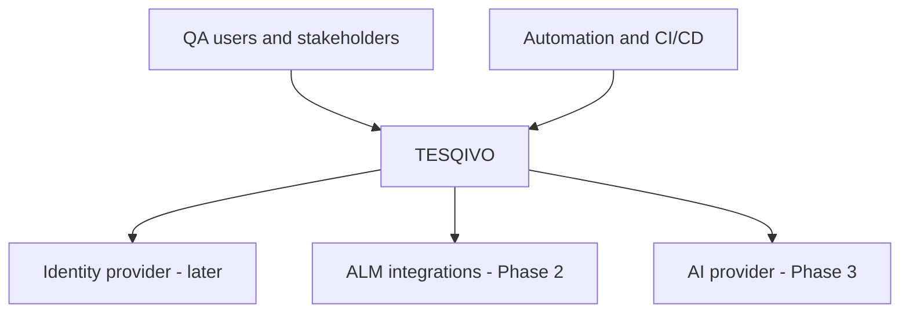

### 32.2 Logical Component Architecture

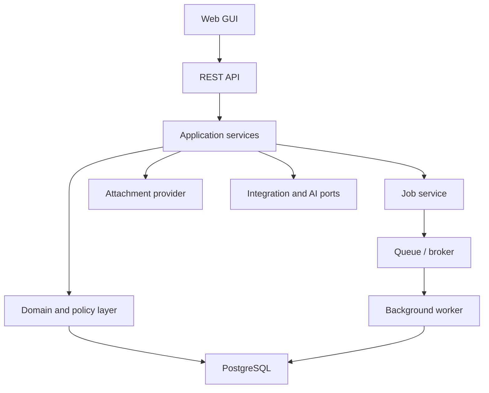

### 32.3 Docker Deployment

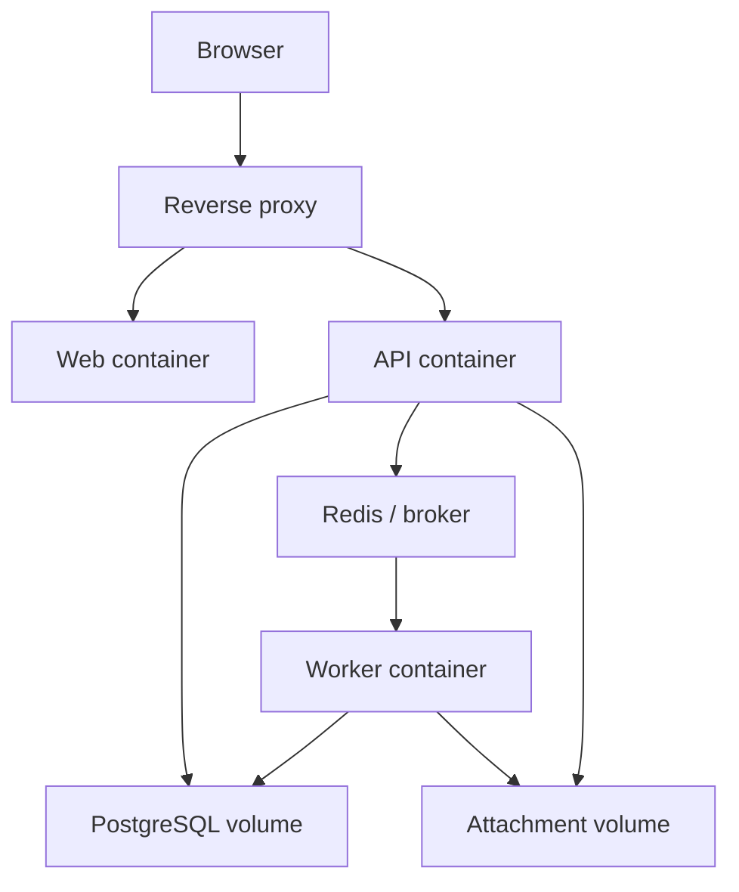

### 32.4 Core Traceability Relationship Model

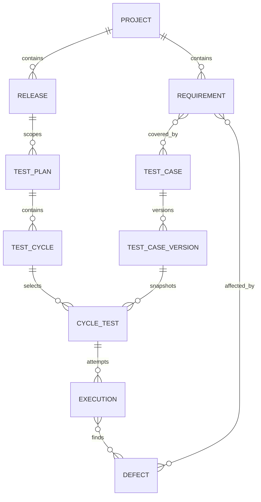

### 32.5 Test-Case State

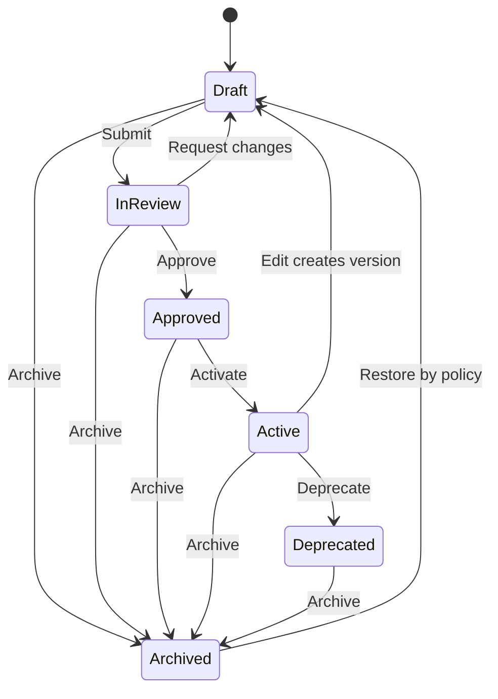

### 32.6 Plan State

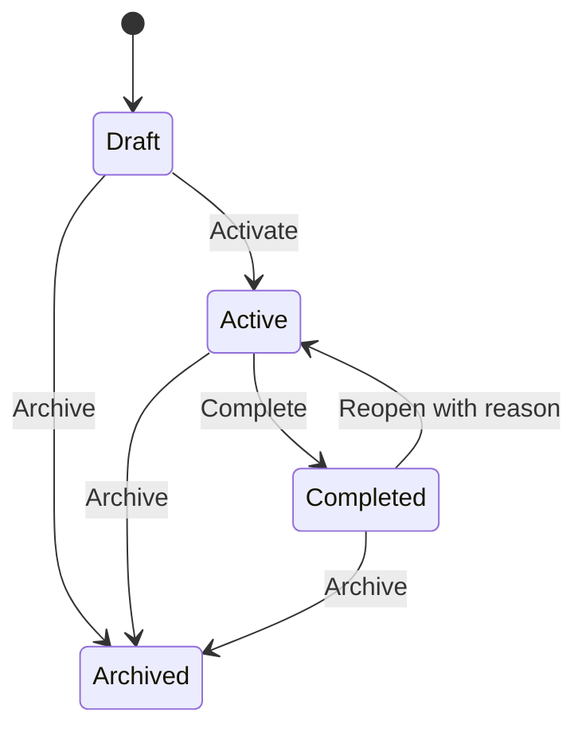

### 32.7 Cycle State

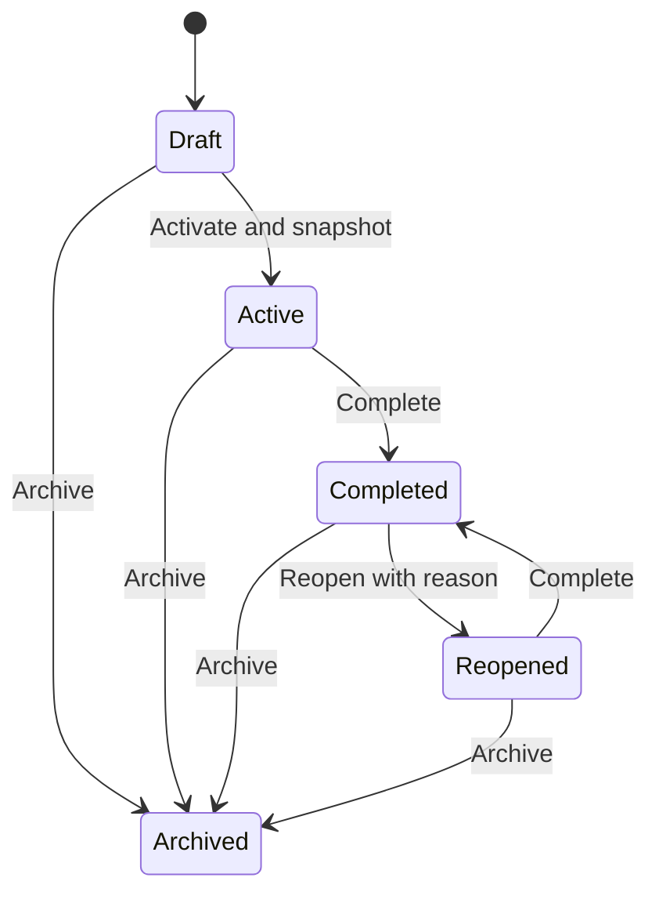

### 32.8 Execution Attempt State

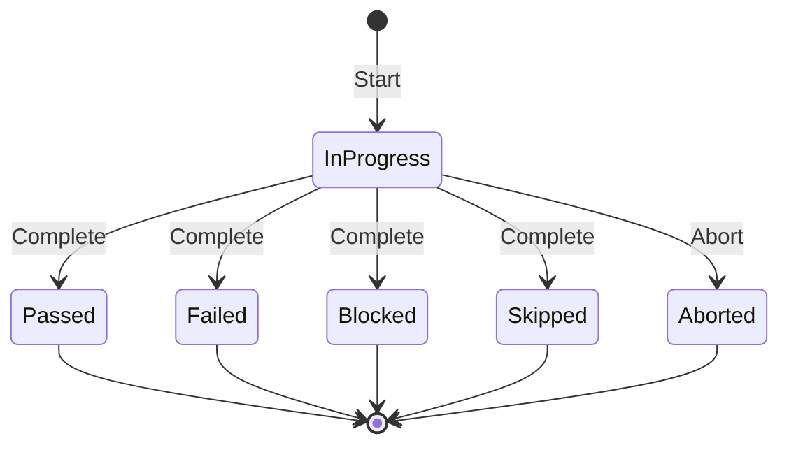

### 32.9 Requirement State

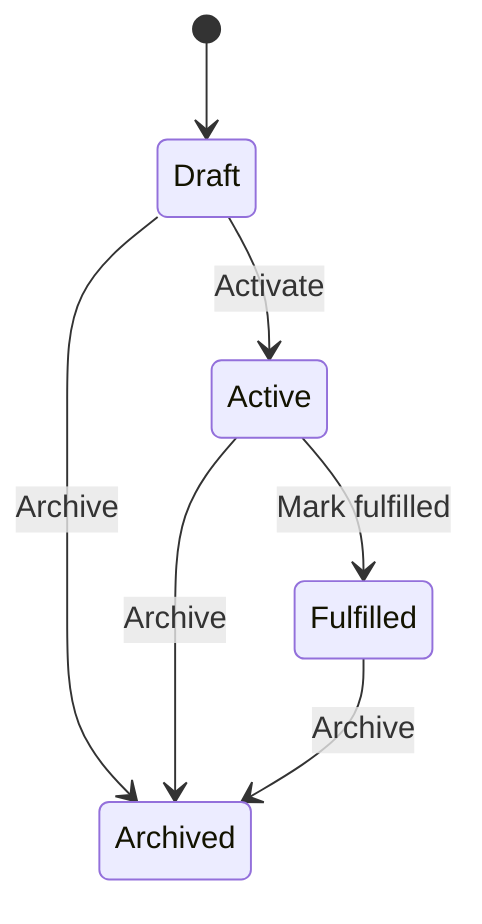

### 32.10 Release State

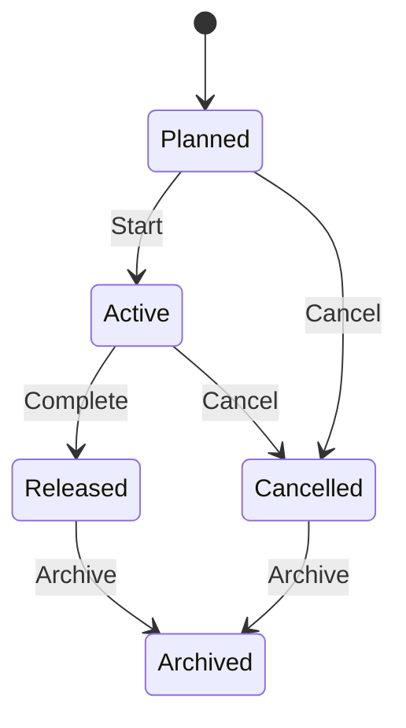

### 32.11 Defect State

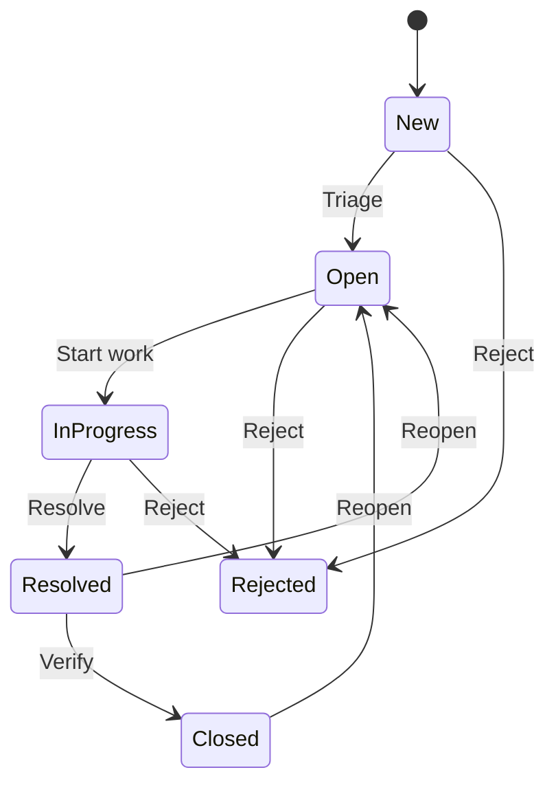

### 32.12 Manual Execution Sequence

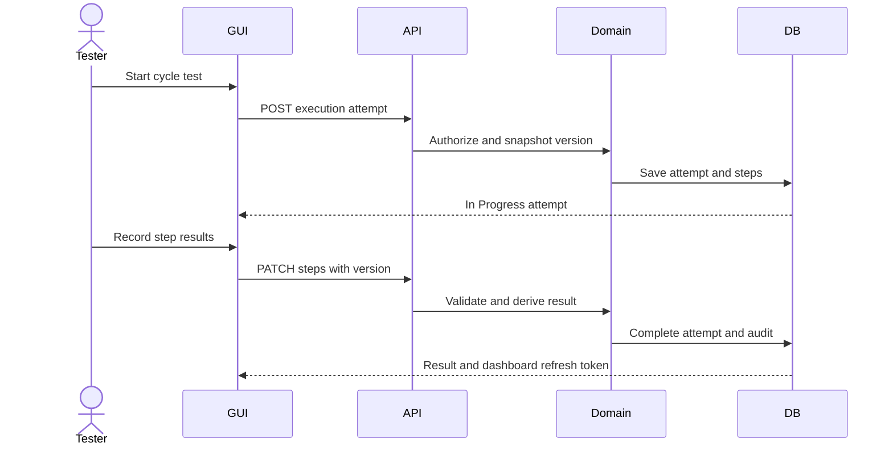

### 32.13 Bulk-Job Sequence

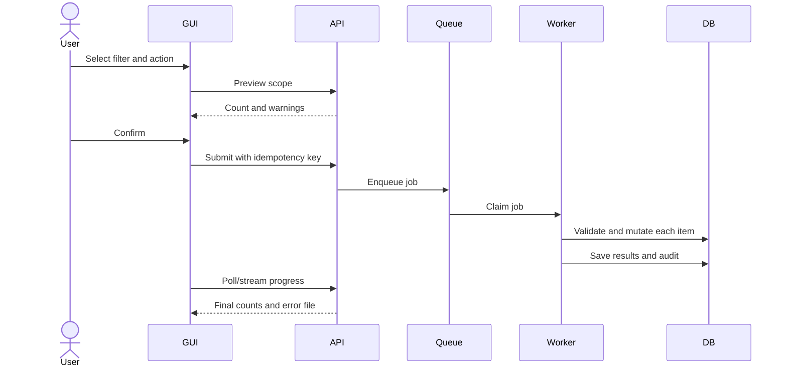

### 32.14 Reporting and Traceability Flow

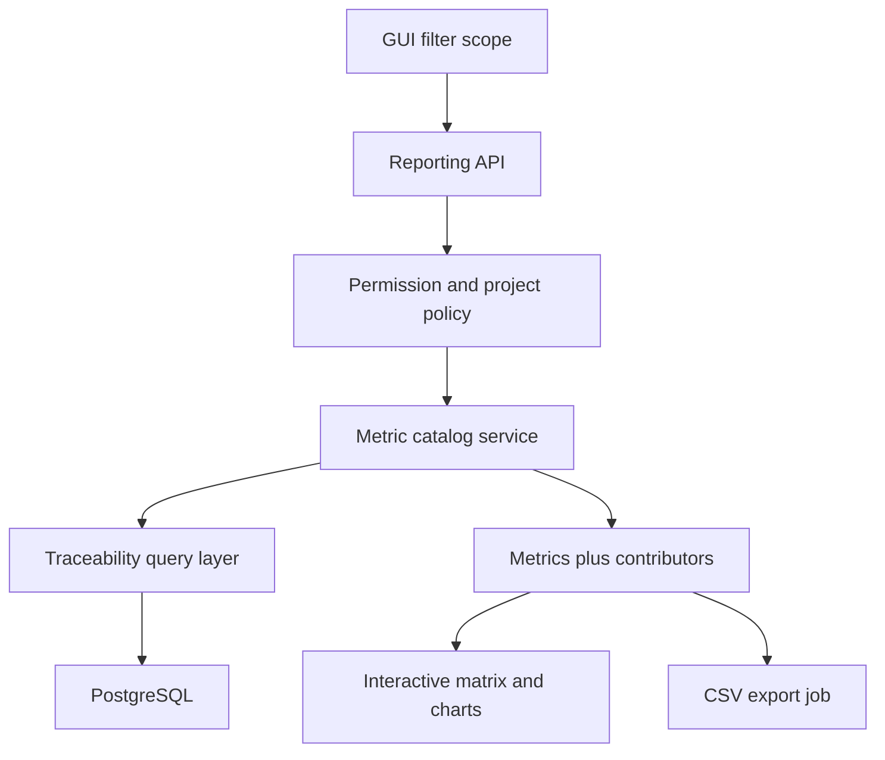

### 32.15 Phase 2 Automation Ingestion

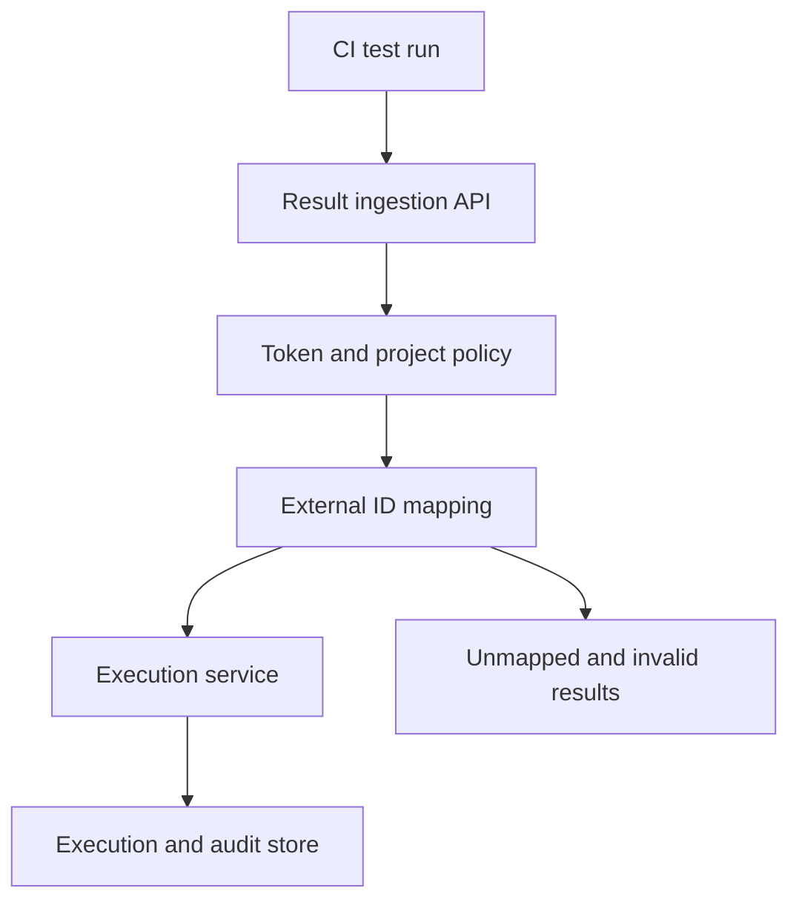

### 32.16 Phase 3 AI Generation and Review

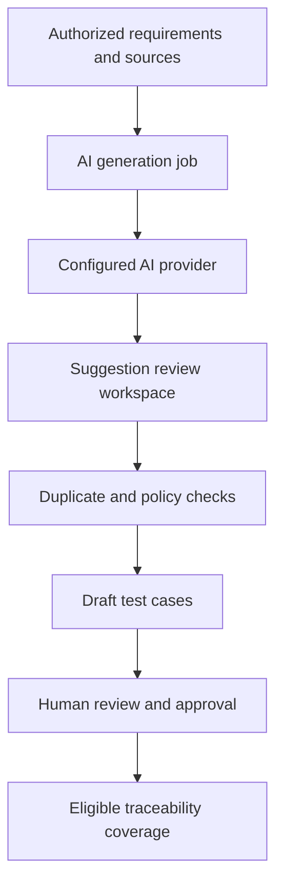
