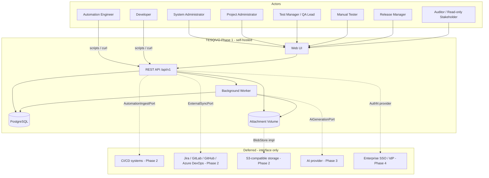

# Artifact 1 — Product Context and Actors

**Question answered:** Who uses TESQIVO, what external systems does it touch in Phase 1,
and which touchpoints are deferred?

**Phase 1 boundary notes**

- The only inbound integration surface in Phase 1 is the documented REST API used by
  humans and ad-hoc automation scripts. No webhooks, no API tokens (session auth only),
  no inbound ALM sync.
- Email is **not** in Phase 1 scope. Password reset issues a one-time token surfaced to
  a System Admin / printed to the API response for an admin-initiated reset
  (decision D-004).
- All deferred connectors are represented in code as ports with a single Phase 1
  in-process implementation (local blob store) or no implementation (raise
  `NotImplementedError` guarded by feature flag defaulting off).
