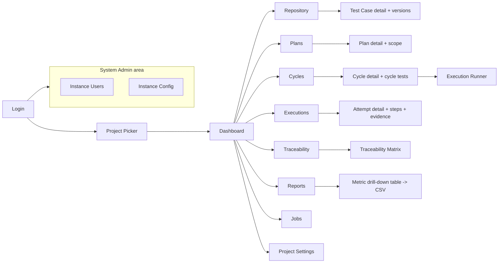

# Artifact 2 — Navigation and Primary User Flows

**Question answered:** What are the stable top-level GUI areas (PRS §14) and what is the
critical end-to-end path an acceptance test walks (PRS §19.3)?

## Navigation map



Every area has a stable URL (`/p/:projectKey/repository`, `/p/:projectKey/cycles/:cycleKey/run`, …).
Filters and scroll position persist per area (PRS §14).

## Critical acceptance path (PRS §19.3)

```mermaid
sequenceDiagram
    actor U as User
    participant UI as Web UI
    participant API as REST API
    U->>UI: Login (username + password)
    UI->>API: POST /api/v1/auth/session
    API-->>UI: 200 + Set-Cookie (HttpOnly session)
    U->>UI: Select Project
    U->>UI: Repository -> New Test Case
    UI->>API: POST /projects/{id}/test-cases  (creates TC + Draft v1)
    U->>UI: Add ordered steps, submit for review, approve, activate
    UI->>API: POST .../versions/{v}/transitions (in_review -> approved -> active)
    U->>UI: Plans -> New Plan -> add scoped test
    UI->>API: POST /projects/{id}/plans ; POST .../scope
    U->>UI: Cycles -> New Cycle (release, env, build) -> Activate
    UI->>API: POST .../cycles ; POST .../cycles/{id}/transitions (draft -> active)
    Note over API: Activation snapshots approved version steps into each Cycle Test
    U->>UI: Open Execution Runner -> start attempt
    UI->>API: POST /cycle-tests/{id}/attempts
    U->>UI: Set each step result + evidence -> complete
    UI->>API: PATCH /attempts/{id}/steps/{n} ; POST /attempts/{id}/complete
    API-->>UI: attempt PASSED/FAILED (derived, PRS §7.4)
    U->>UI: Dashboard shows updated completion + pass rate + coverage
    UI->>API: GET /projects/{id}/reports/summary
```

## High-impact actions requiring a scope/consequence confirmation (PRS §14)

| Action | Confirmation shows |
|---|---|
| Activate cycle | count of cycle tests to be snapshotted, approved-version gaps |
| Bulk operation | resolved item count, captured filter text, authz failures |
| CSV import (strict) | rows valid / invalid, "commits nothing if any row fails" |
| Reopen completed cycle/plan | reason required, effect on authoritative attempt |
| Permanent purge (protected endpoint) | irreversible, audited, admin-only |
| Archive test case with active cycle scope | existing cycles keep their snapshot |
