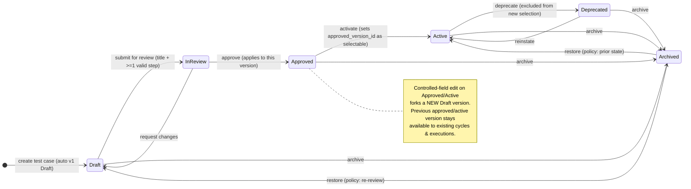
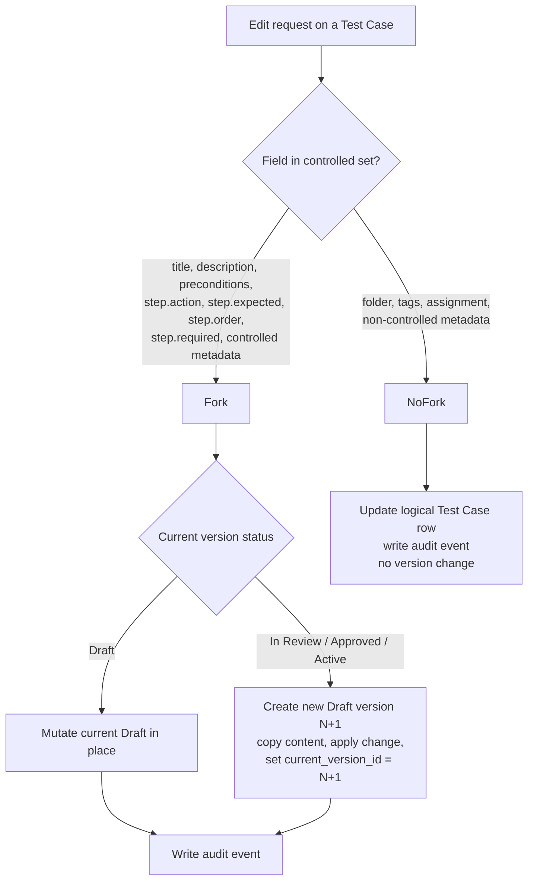

# Artifact 3 — Test Case / Test Case Version Lifecycle and Versioning

**Question answered:** How do the logical Test Case state and the per-version review
state interact, and exactly when is a new version forked? (PRS §6)

## Two coupled state machines

The **logical Test Case** has a lifecycle state. Each **Test Case Version** has a review
status. The logical state is *derived* from versions + lifecycle events.

## Version fork decision

**Controlled-field list** is a single constant in `domain/test_case/controlled_fields.py`
(PRS §6.2 "centralized in the domain service"). Changing it is a code+migration change,
never per-project config in Phase 1.

## Invariants

- `current_version_id` always points to the newest version (max `version_number`).
- `approved_version_id` is null until first approval; points at the version approved,
  not necessarily the newest.
- A version row, once its status leaves `Draft`, is content-immutable. Enforced by a
  DB trigger + domain guard.
- Draft → In Review requires: non-empty title AND ≥1 step with non-empty action and
  expected result.
- Invalid transition → `409 STATE_TRANSITION_NOT_ALLOWED`.
- Archive never cascades to cycles, executions, links, attachments, audit (PRS §6.3).
