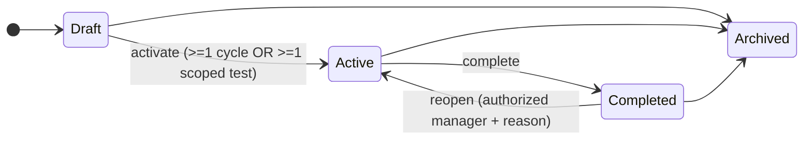
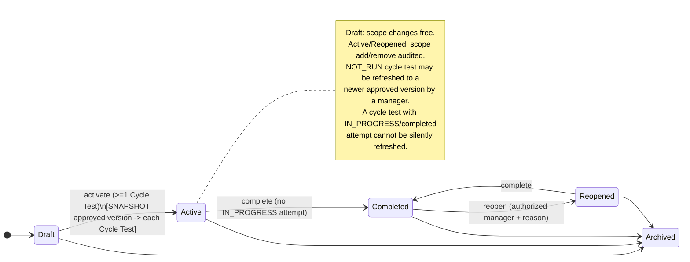
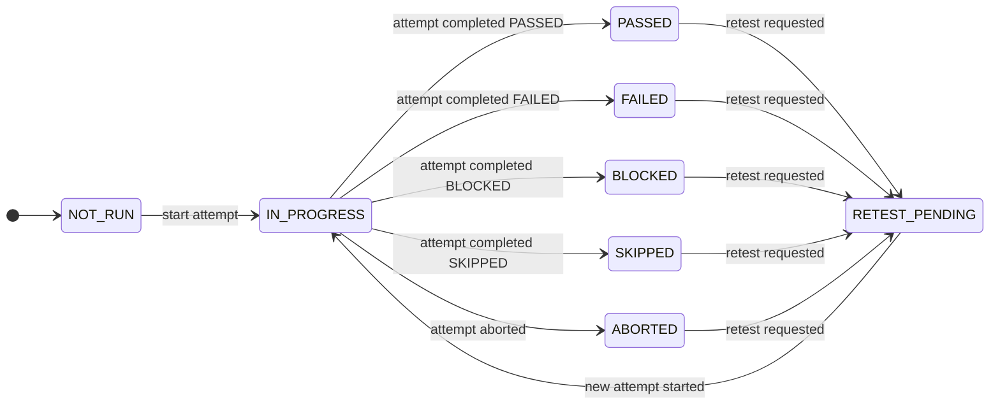
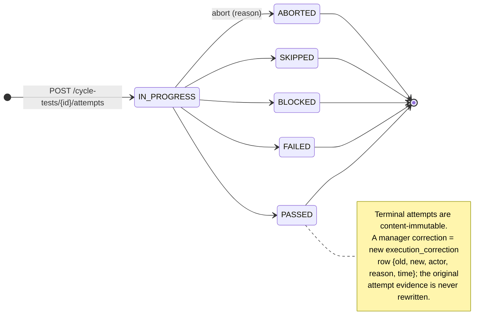
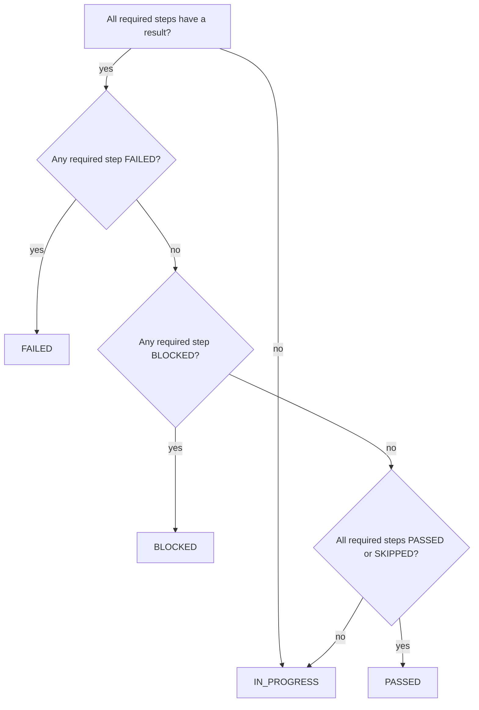

# Artifact 4 — Plan, Cycle, Cycle Test, and Execution Attempt State Diagrams

**Question answered:** What are the lifecycle states and guarded transitions for the
execution side of the domain, and where does snapshotting happen? (PRS §7)

## Test Plan

## Test Cycle

## Cycle Test (displayed result is derived, not stored as truth)

The displayed value = result of the **authoritative attempt** (PRS §7.5), or `NOT_RUN`
if none, or `RETEST_PENDING` when a retest was requested and the new attempt is not
complete. It is computed on read, never written as the source of truth.

## Execution Attempt (immutable once terminal)

## Overall-result derivation (PRS §7.4) — pure function

`SKIPPED` and `ABORTED` are terminal but non-passing. An override of the derived result
requires permission + audited reason.
