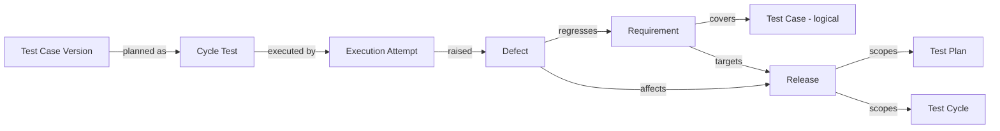
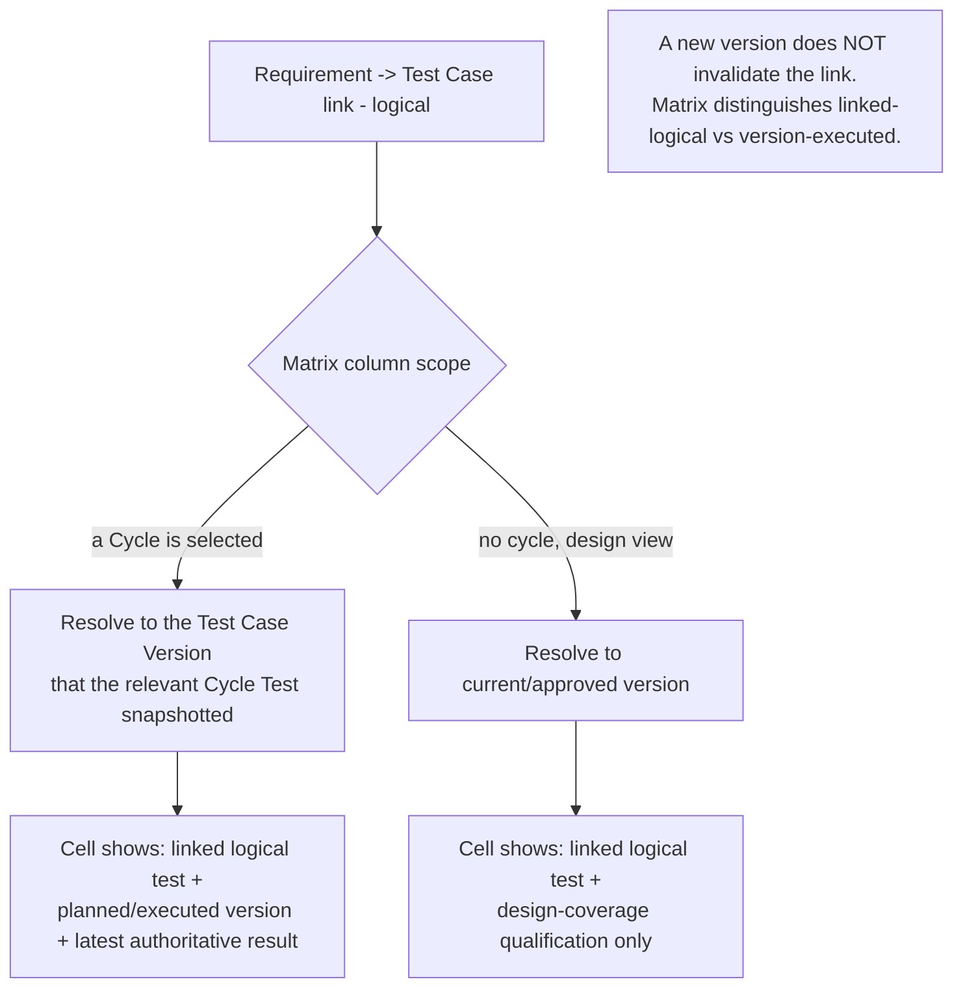
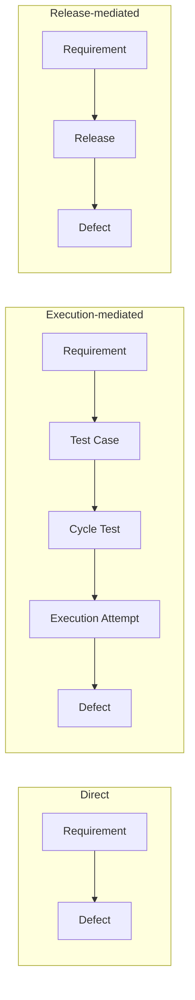
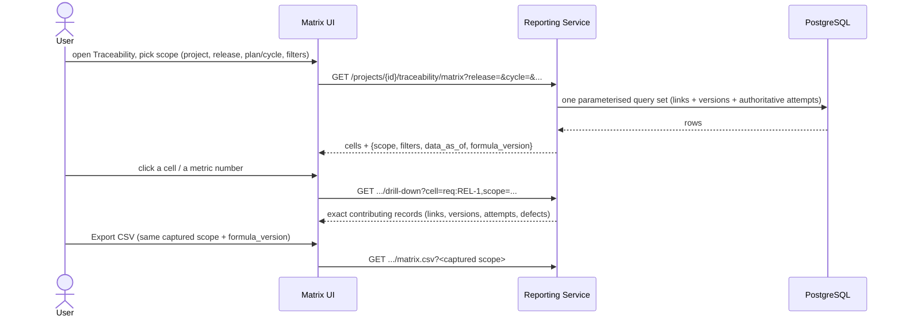

# Artifact 5 — Traceability Relationship Model and Matrix Interaction

**Question answered:** What links are legal in Phase 1, how does a Requirement→Test Case
link resolve to a version in the matrix, and how does defect impact propagate? (PRS §8.2)

## Legal Phase 1 relationships



Any other `source_type → target_type` pair is rejected (`422 VALIDATION_ERROR`,
`code: RELATIONSHIP_NOT_ALLOWED`). All endpoints of a link must share `project_id`.

## Trace link record (first-class, soft-removable)

```
id, project_id, source_type, source_id, target_type, target_id,
relationship_type, origin (manual|import|system),
created_by, created_at, removed_by, removed_at, external_reference?
```

- Duplicate **active** (source,target,relationship) → `409 DUPLICATE_RESOURCE`.
- Removal sets `removed_*`; row is retained, excluded from normal metrics, still shown
  in data-quality views.
- Invalid / unresolved / stale / deprecated / archived links stay visible in the
  Data Quality panel (PRS §8.2, M-13).

## Matrix version resolution



## Defect impact paths (PRS §8.2) — only these are counted



Execution-mediated impact is valid **only** when the attempt's Cycle Test resolves to a
Test Case that is linked to the Requirement. Drill-down names the exact path used.

## Matrix interaction flow


