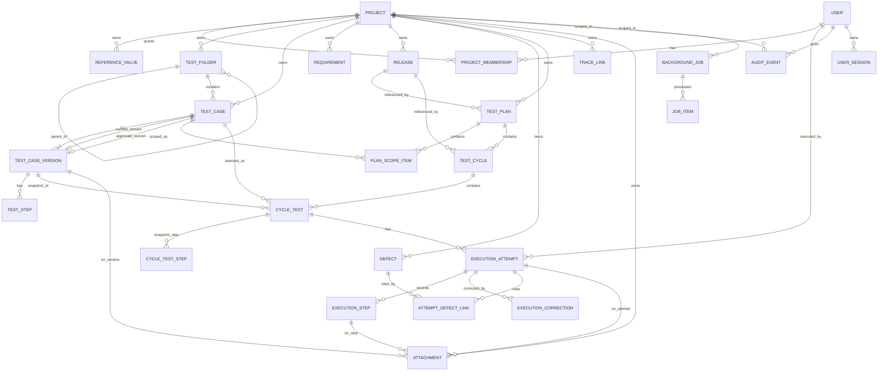

# Artifact 6 — Core Logical Entity-Relationship Model

**Question answered:** What are the Phase 1 tables, their identity, and the relationships
— including memberships, links, jobs, audit, and attachments? (PRS §5, §22)

> Logical model. Physical columns (indexes, partitions, check constraints) are finalized
> in Alembic migrations only after this model is reviewed (PRS §20 closing note).

## Identity rules (PRS §5)

| Concept | Rule |
|---|---|
| Internal id | `uuid` (v4), primary key on every table |
| Project key | `project.key` — e.g. `PAY` — unique instance-wide, immutable, never reused |
| Entity key | `<PROJECT_KEY>-<TYPE>-<seq>` — e.g. `PAY-TC-142`, `PAY-REQ-7`, `PAY-DEF-30` — project-unique, readable, immutable, never reused. Per-(project,type) counter table. |
| Display name | free text, mutable, does not affect identity |
| Concurrency | mutable roots (`test_case`, `test_case_version` while Draft, `requirement`, `release`, `defect`, `test_plan`, `test_cycle`, `trace_link`) carry integer `version` |

## Key column sketches (not exhaustive — see migrations)

**project** `(id, key, name, description, status, timezone, created_*, version)`
**user** `(id, username, email, display_name, password_hash, is_system_admin, status[active|disabled], failed_login_count, locked_until, created_*)`
**project_membership** `(id, project_id, user_id, role[project_admin|test_manager|tester|viewer], status[active|removed], added_by, added_at, removed_at)` — unique `(project_id, user_id)` where active
**reference_value** `(id, project_id, kind[component|release_tag|environment|tag|test_type|attachment_policy], value, is_active)` — note: `release` entity is separate; `kind=environment` etc. are simple lookups
**test_folder** `(id, project_id, parent_id, name, path, order_index, version)`
**test_case** `(id, project_id, key, folder_id, title, lifecycle_state, current_version_id, approved_version_id, automation_status[not_applicable|candidate|automated], is_eligible_for_automation, created_*, version)`
**test_case_version** `(id, test_case_id, version_number, status[draft|in_review|approved|active_snapshot? NO -> draft|in_review|approved], title, description, preconditions, controlled_metadata jsonb, author_id, change_summary, created_at, content_locked bool)`
**test_step** `(id, version_id, order_index, action, expected_result, is_required, created_at)`
**requirement** `(id, project_id, key, title, description, req_type, status[draft|active|fulfilled|archived], priority, owner_id, component, release_id?, source_type[manual|import], external_reference?, created_*, version)`
**release** `(id, project_id, key, name, description, status[planned|active|released|cancelled|archived], start_date, end_date, owner_id, version_label?, created_*, version)`
**defect** `(id, project_id, key, summary, description, status[new|open|in_progress|resolved|closed|rejected], severity, priority, reporter_id, owner_id?, environment?, release_id?, detected_build?, resolved_build?, resolution?, source_type, external_reference?, created_*, version)`
**test_plan** `(id, project_id, key, name, description, objective, owner_id, release_id?, status[draft|active|completed|archived], created_*, version)`
**plan_scope_item** `(id, plan_id, test_case_id, added_by, added_at, source[manual|filter], filter_snapshot jsonb?)` — unique `(plan_id, test_case_id)`
**test_cycle** `(id, plan_id, project_id, key, name, description, release_id?, environment, build, browser?, device?, platform?, start_date?, end_date?, status[draft|active|completed|reopened|archived], created_*, version)`
**cycle_test** `(id, cycle_id, project_id, test_case_id, test_case_version_id, assigned_to?, added_by, added_at, removed_at?, snapshot_taken_at?)` — unique `(cycle_id, test_case_id)` where not removed
**cycle_test_step** `(id, cycle_test_id, order_index, action, expected_result, is_required)` — the immutable snapshot
**execution_attempt** `(id, cycle_test_id, project_id, plan_id, cycle_id, test_case_version_id, release_id?, environment, build, tester_id, started_at, ended_at?, status, overall_result?, result_overridden bool, override_reason?, notes?, created_at)`
**execution_step** `(id, attempt_id, cycle_test_step_id, order_index, result[not_run|passed|failed|blocked|skipped], comment?, recorded_at)`
**execution_correction** `(id, attempt_id, field, old_value, new_value, actor_id, reason, created_at)` — append-only
**attempt_defect_link** `(id, attempt_id, defect_id, created_by, created_at)`
**trace_link** `(id, project_id, source_type, source_id, target_type, target_id, relationship_type, origin, created_by, created_at, removed_by?, removed_at?, external_reference?)`
**attachment** `(id, project_id, parent_type[version|attempt|step], parent_id, filename, stored_name, content_type, size_bytes, checksum, uploaded_by, uploaded_at, deleted_at?)`
**audit_event** `(id, occurred_at, actor_type[user|system], actor_id?, project_id?, entity_type, entity_id, entity_key?, action, before jsonb?, after jsonb?, source[gui|api|import|bulk|system], correlation_id, job_id?)` — append-only, no update/delete via app
**background_job** `(id, project_id?, type, created_by, created_at, status[queued|running|completed|partially_completed|failed|cancelled], scope_snapshot jsonb, idempotency_key?, requested_count, resolved_count, succeeded, failed, skipped, unchanged, output_ref?, retryable bool, lease_owner?, lease_expires_at?, started_at?, finished_at?)`
**job_item** `(id, job_id, ordinal, target_ref, status[pending|succeeded|failed|skipped|unchanged], error_code?, error_message?, mutation_key, processed_at?)` — unique `(job_id, mutation_key)`
**user_session** `(id, user_id, created_at, expires_at, last_seen_at, ip?, user_agent?, revoked_at?)` — cookie carries `id` (opaque, random 256-bit)
**entity_counter** `(project_id, entity_type, next_seq)` — row-locked to mint keys

## Deferred fields present as nullable / interface only

- No `api_token`, `webhook`, `webhook_delivery`, `external_sync_state` tables in Phase 1.
- `external_reference` columns exist (nullable) so Phase 2 sync can populate them.
- `generation_job`, `suggestion`, `generation_result` — Phase 3, not created.
