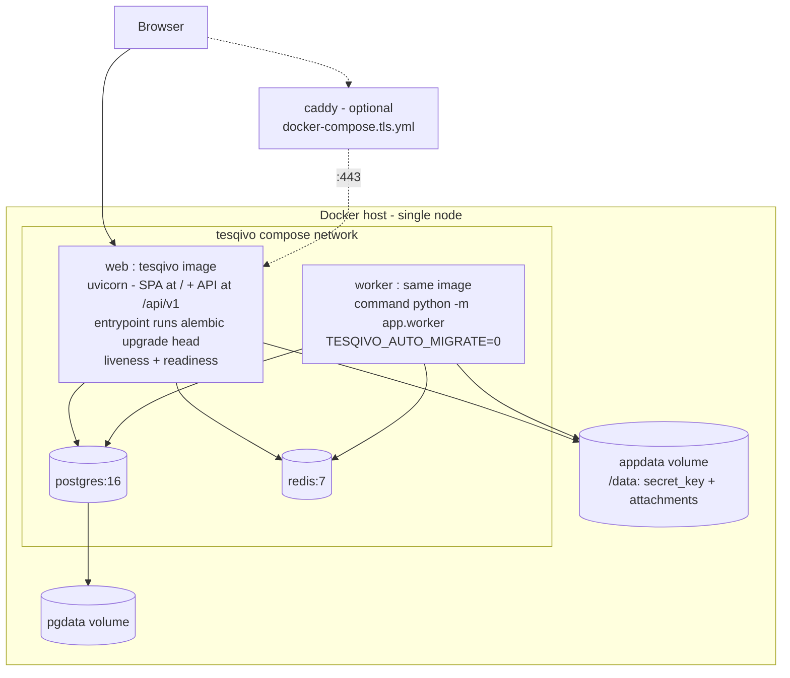
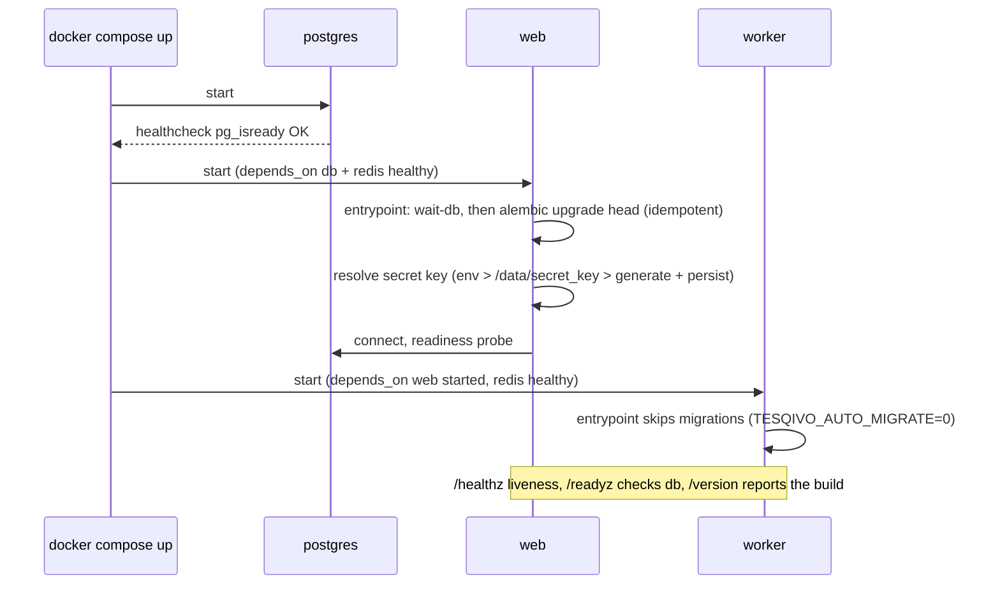

# Artifact 8 — Docker Deployment and Persistence

**Question answered:** What containers run, what persists, and how does a clean host come
up healthy with a secure first admin? (PRS §15, §19.1)

TESQIVO ships as a **single image** (`ghcr.io/abhid001/tesqivo`) that serves both the SPA
(at `/`) and the API (at `/api/v1`). A self-hoster downloads one `docker-compose.yml` and
runs `docker compose up -d` — no source checkout, no build, no `.env` required.



## Startup ordering



## First-admin flow

**Preferred — CLI (no token):** shell access to the container is the authorization gate.

```
docker compose exec web python -m app.cli create-admin
```

Prompts for username / email / display name / password, or takes
`--username --email --password [--display-name]` for automation. Works only while zero
users exist.

**Alternative — browser:** set `TESQIVO_BOOTSTRAP_TOKEN` to a strong random value, open the
app, and complete the "create first administrator" screen. `GET /api/v1/setup/status`
returns `{needs_setup: true}` only while zero users exist; `POST /api/v1/setup` with the
`X-Bootstrap-Token` header creates the admin. Any later call → `409 SETUP_ALREADY_COMPLETED`.

## Configuration contract

Nothing is required for a local trial. Missing/invalid **`TESQIVO_DB_URL`**,
**`TESQIVO_REDIS_URL`** or **`TESQIVO_PUBLIC_URL`** → the process refuses to start with a
single clear log line naming the variable (no stack trace, no secret echo). The bundled
compose file supplies working defaults for all three.

| Var | Purpose | Default |
|---|---|---|
| `TESQIVO_DB_URL` | Postgres DSN | from compose (`db` service) |
| `TESQIVO_REDIS_URL` | Redis DSN | from compose (`redis` service) |
| `TESQIVO_PUBLIC_URL` | absolute base URL for cookies / links | `http://localhost:8080` |
| `TESQIVO_SECRET_KEY` | session signing / CSRF (≥32 bytes) | auto-generated into `/data/secret_key` |
| `TESQIVO_SECRET_KEY_FILE` | where the generated secret is persisted | `/data/secret_key` |
| `TESQIVO_STATIC_DIR` | built web UI to serve at `/` | `/app/static` (set by the image) |
| `TESQIVO_AUTO_MIGRATE` | entrypoint runs `alembic upgrade head` | `1` (`0` for the worker) |
| `TESQIVO_BOOTSTRAP_TOKEN` | optional gate for the browser setup screen | unset |
| `TESQIVO_ATTACHMENT_DIR` | blob directory | `/data/attachments` |
| `POSTGRES_PASSWORD` | bundled database password | `tesqivo` |
| `TESQIVO_HTTP_PORT` | host port the app publishes on | `8080` |

## Persistence, backup, restore

- Two named volumes: `pgdata` (database) and `appdata` (`/data` — the generated secret key
  and uploaded attachments).
- `make backup` → `pg_dump -Fc` + a `tar` of the `appdata` volume → timestamped `./backups/`.
- `make restore BACKUP=<db dump> [ATTACH=<appdata tgz>]` → `pg_restore --clean`, restore the
  volume, restart `web` (its entrypoint reapplies `alembic upgrade head`).
- Raw commands (no repo checkout) are in `docs/self-hosting.md`.

## Upgrade

```
docker compose pull && docker compose up -d
```

The `web` entrypoint reapplies `alembic upgrade head` on start — migrations are
inspector-guarded and idempotent. Confirm with `GET /api/v1/version`.

## Optional TLS

`docker compose -f docker-compose.yml -f docker-compose.tls.yml up -d` adds a Caddy service
that obtains and renews a Let's Encrypt certificate for `$TESQIVO_DOMAIN`. Users who
already run a reverse proxy point it at the `web` container's published port instead.
