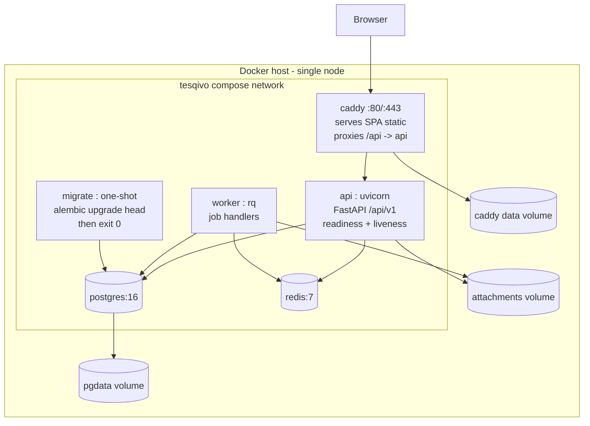
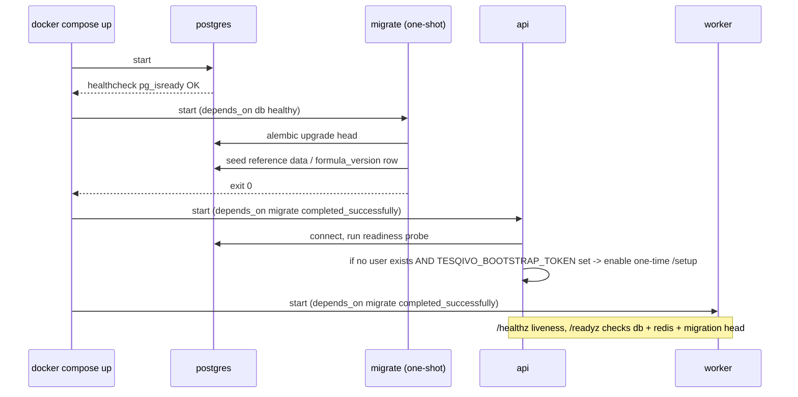

# Artifact 8 — Docker Deployment and Persistence

**Question answered:** What containers run, what persists, and how does a clean host come
up healthy with a secure first admin? (PRS §15, §19.1)

## Startup ordering

## Configuration contract (fail fast on missing — PRS §15)

| Var | Purpose | Required |
|---|---|---|
| `TESQIVO_DB_URL` | Postgres DSN | yes |
| `TESQIVO_REDIS_URL` | Redis DSN | yes |
| `TESQIVO_SECRET_KEY` | session signing / CSRF | yes (>= 32 bytes) |
| `TESQIVO_BOOTSTRAP_TOKEN` | one-time first-admin setup gate | yes on first boot |
| `TESQIVO_PUBLIC_URL` | absolute base URL for cookies / links | yes |
| `TESQIVO_ATTACHMENT_DIR` | blob volume mount | default `/data/attachments` |
| `TESQIVO_MAX_UPLOAD_MB` | per-file cap | default 25 |
| `TESQIVO_SESSION_TTL_HOURS` | session expiry | default 12 |

Missing/invalid required config → API refuses to start with a single clear log line
naming the variable. No stack trace, no secret echo.

## First-admin flow (secure — PRS §19.1)

1. Operator sets `TESQIVO_BOOTSTRAP_TOKEN` to a strong random value in `.env`.
2. `GET /api/v1/setup/status` → `{needs_setup: true}` only while zero users exist.
3. `POST /api/v1/setup` with header `X-Bootstrap-Token` + admin username/password
   (Argon2id min length enforced). Creates the System Admin, invalidates setup.
4. Any later call to `/setup` → `409` `SETUP_ALREADY_COMPLETED`.

## Persistence, backup, restore (PRS §15)

- `pgdata` and `attachments` are named volumes.
- `make backup` → `pg_dump -Fc` + `tar` of attachments → timestamped `./backups/`.
- `make restore BACKUP=<file>` → drop/recreate schema, `pg_restore`, untar attachments,
  run `alembic upgrade head`.
- Restore is exercised by an automated test in CI against a fresh compose stack
  (acceptance §19.10). Targets: RPO 24h, RTO 4h.

## Upgrade

`docker compose pull && docker compose up -d` re-runs the `migrate` one-shot; API waits
for it. Migration compatibility policy documented in `docs/OPERATIONS.md`.
