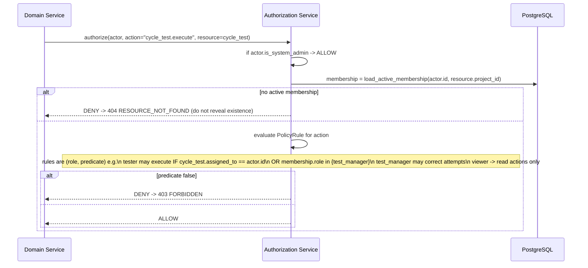

# Artifact 9 — Authentication and Authorization Sequence

**Question answered:** How is a session established, and how is every operation
authorized against concrete conditions rather than role labels? (PRS §10, §15)

## Login → session

```mermaid
sequenceDiagram
    actor U as User
    participant UI as SPA
    participant API as API
    participant DB as PostgreSQL
    U->>UI: username + password
    UI->>API: POST /api/v1/auth/session {username, password}
    API->>DB: load user by username
    alt user missing or disabled or locked_until > now
        API-->>UI: 401 INVALID_CREDENTIALS (uniform message + timing)
    else
        API->>API: argon2.verify(password, hash)
        alt mismatch
            API->>DB: failed_login_count += 1; set locked_until if threshold
            API-->>UI: 401 INVALID_CREDENTIALS
        else match
            API->>DB: reset failed_login_count; INSERT user_session (256-bit id, expires_at)
            API-->>UI: 200 + Set-Cookie: tesqivo_session=<id>; HttpOnly; Secure; SameSite=Lax
        end
    end
    UI->>API: GET /api/v1/me  (subsequent requests send cookie)
    API-->>UI: {user, is_system_admin, memberships:[{project_key, role}]}
```

CSRF: state-changing requests require header `X-Correlation-ID` **and** either a
same-site cookie context or a double-submit CSRF token issued at login (SPA sends it
back in `X-CSRF-Token`). `SameSite=Lax` + custom-header requirement blocks cross-site POST.

## Authorization check (every domain operation)



## Policy table shape (`domain/authz/policies.py`)

| action | allowed roles | extra predicate (concrete condition) |
|---|---|---|
| `test_case.create` | test_manager | — |
| `test_case.edit` | test_manager, tester | tester only if `test_case.created_by == actor` and version is Draft |
| `version.transition` | test_manager | approve/activate manager-only |
| `plan.manage` / `cycle.manage` | test_manager | — |
| `cycle.reopen` / `plan.reopen` | test_manager | reason required |
| `cycle_test.execute` | test_manager, tester | tester only if `assigned_to == actor` or unassigned |
| `attempt.correct` | test_manager | reason required, target attempt terminal |
| `requirement.create` / `defect.create` | test_manager, tester | — |
| `trace_link.create` | test_manager, tester | tester limited to links from own content |
| `bulk.run` | test_manager | per-item re-check still applies |
| `export.run` | test_manager, tester, viewer | scope limited to authorized rows |
| `audit.view` | project_admin, test_manager | separate permission |
| `project.settings` / `membership.manage` | project_admin | — |
| instance users / config | system_admin | — |

GUI hides controls the actor can't use, but the server check is authoritative
(PRS §10 "GUI visibility is not authorization"). Archived/disabled users: valid as
historical actors, cannot authenticate, cannot be granted new membership.
