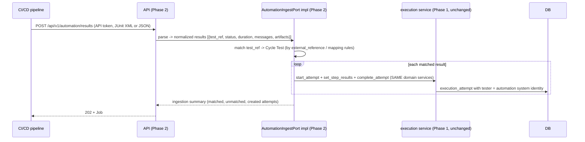

# Artifact 13 — Phase 2 Automation Ingestion Flow (Anticipated, Not Implemented)

**Question answered:** What interface must Phase 1 leave stable so Phase 2 automation
result ingestion drops in without reshaping the domain? (PRS §4, Phase 2 list)

> **Deferred.** Phase 1 ships the `AutomationIngestPort` interface with **no
> implementation** and no routes. This diagram constrains Phase 1 data shapes only.

## What Phase 1 must already guarantee for this to fit

| Requirement on Phase 1 | Where honored |
|---|---|
| `execution_attempt` accepts a **system** actor, not only a human `tester_id` | `execution_attempt.tester_id` FK nullable + `actor_type` on audit; Phase 1 keeps it human-only but schema allows system |
| `external_reference` column on `cycle_test` / `test_case` / `requirement` / `defect` | present, nullable |
| Attempt creation + completion is fully expressible through domain services with no GUI-only assumptions | execution service functions take DTOs, not request objects |
| Idempotency keys on creates/ingestion | `Idempotency-Key` handling generic in middleware + `background_job.idempotency_key` |
| `automation_status` on `test_case` (`not_applicable` / `candidate` / `automated`) | present (drives M-12) |

## Explicitly out of Phase 1

API tokens, webhooks + delivery history, JUnit XML parser, CI/CD guidance docs,
result-to-cycle-test matching rules, unmatched-result triage UI.
