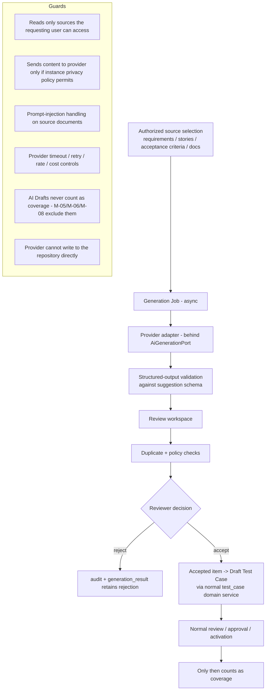

# Artifact 14 — Phase 3 AI Generation / Review / Approval Flow (Anticipated)

**Question answered:** What boundary must Phase 1 preserve so AI test generation can be
added later without letting AI output bypass review, versioning, coverage, or audit?
(PRS §17)

> **Deferred.** Phase 1 ships the `AiGenerationPort` interface with **no
> implementation**, no provider config, no routes, feature flag `AI_GENERATION=off`.

## What Phase 1 must already guarantee

| Requirement on Phase 1 | Where honored |
|---|---|
| A Test Case can only become coverage-qualifying via approve+activate | version state machine (Artifact 3); M-05/06/08 predicates check `approved`/`active` only |
| `test_case_version.source_type` can record `ai_generated` | enum has room; Phase 1 uses `manual`/`import` |
| Creating a Draft test is a pure domain-service call (no GUI coupling) | `test_case_service.create()` takes a DTO |
| Audit records actor + source for every creation | `audit_event.source` enum extensible; `actor_type` includes `system` |
| Async job infra with per-item results, retention, cancellation | `background_job` / `job_item` generic |
| Attachment / document access is authz-checked per parent | attachment service |

## Explicitly out of Phase 1

Provider adapters, prompt templates + versioning, `generation_job` / `suggestion` /
`generation_result` tables, review workspace UI, duplicate-detection model, evaluation
datasets, quality thresholds, coverage-gap analytics, flaky/effectiveness/risk models.
